# DeepSeek Harness 技术架构与代码目录结构说明

> 本文基于本机 checkout 的实际代码与文档生成，非官方文档。所有结论均可回溯到文中标注的源文件路径。
> 快照信息：版本 `0.1.5-rc.2`，commit `c291e79`（`Merge pull request #3977`）。
> 仓库：`deepseek-ai/deepseek-harness`，MIT 协议，Developer Preview 阶段（会有破坏性变更）。

---

## 0. 摘要

DeepSeek Harness（命令名 `dsh`）是 DeepSeek AI 开源的 **agent harness**（智能体运行时框架），核心设计口号是 **"Everything is a Plugin"** —— 不存在一个需要打补丁的特权内核：模型适配器、工具注册表、会话日志、乃至 agent 主循环本身，全部是插件。

底座是 **Cordis**（已 vendored 并 rescope 到 `@deepseek-ai/cordis`），一个以 Service + Typed Event + 可逆 Effect 为核心的插件框架。

| 指标 | 数值 |
|---|---|
| npm 包数量（`packages/<group>/<pkg>/`） | **268** |
| 包分组数量 | **50** |
| `src/` 下 TypeScript 源文件 | **1,778** |
| 源文件总行数 | **约 34 万行** |
| `*.spec.ts` 测试文件 | **1,021** |
| `tests/` 目录 | **272** |
| 顶层应用（`apps/`） | **4**（cli / web / desktop / desktop-host） |
| vendored Cordis 包 | **9** |
| 构建/校验脚本（`scripts/`） | **215** |
| GitHub workflow | **21** |
| 回放快照用例 | **150**（session 84 / web 40 / sdk 18 / acp 8） |

三个必须记住的架构约束：

1. **模型可见 ⟺ 已记录**（Model-visible means logged）。任何进入模型请求的内容，都必须能从 session 日志重建。
2. **能力接缝（capability seam）必须三角齐全**：Service Definition（接口/服务）、Service Provider（实现）、Consumer（消费方，通常是模型工具）。单独一个角色不构成接缝。
3. **扩展插件依赖 Service Definition，绝不依赖具体 Provider**。例如所有扩展只依赖 `dsh-agent`，不依赖 `dsh-agent-loop`，所以主循环可替换。

---

## 1. 全局技术架构

### 1.1 分层总览

```mermaid
flowchart TB
  subgraph ENTRY["① 应用入口层"]
    CLI["apps/cli<br/>dsh CLI（唯一受支持的 Node 应用启动器）"]
    WEBAPP["apps/web<br/>Vite 构建的浏览器 SPA 入口"]
    DESK["apps/desktop + apps/desktop-host<br/>Electron 桌面壳 + 私有 Node 宿主进程"]
  end

  subgraph COMPOSE["② 组合层（profile / bundle 补丁树）"]
    BOOTPKG["packages/boot<br/>app-boot · cmdline"]
    BUNDLES["packages/bundle<br/>base · web-app · headless · sdk-app · sdk-minimal · acp-app"]
  end

  subgraph FRAMEWORK["③ 框架层（vendored Cordis）"]
    CORDIS["vendor/cordis · loader · include · group · hmr · timer<br/>cosmokit · schemastery · logger-console"]
  end

  subgraph PRESENT["④ 表现与网关层（Host ⇄ Client）"]
    HOST["packages/host<br/>webserver · frontend-static · directory-picker · open-in-app"]
    API["packages/api<br/>gateway · remotes · session-controller · workspace-controller<br/>settings-controller · workspace-files"]
    TYPERT["packages/typert<br/>protocol · generator · registry · loader"]
    CLIENT["packages/client<br/>connection · modules · store · locale · ui-*（43 个 UI 功能插件）"]
  end

  subgraph SEAMS["⑤ 能力接缝层（Service Definition + Provider + Consumer）"]
    LLM["llm/*<br/>ctx.llm"]
    TOOLSEAM["shell · terminal · fs · subprocess · sandbox<br/>lsp · web · code-runtime · skill"]
    ORCH["subagent · workflow · jobs · webhook · e2b"]
    DATASEAM["session-persistence · storage · settings · credentials<br/>attachment · spill · session-query · workspace"]
    HUMAN["interaction（commands · approval · user-questions · permission-presets）"]
  end

  subgraph SPINE["⑥ 核心脊柱层（每个组合都会启动）"]
    S_SESSION["core/session<br/>ctx.sessions — 追加式 SessionEvent 日志"]
    S_PROMPT["core/system-prompt<br/>ctx.systemPrompt"]
    S_TOOLS["core/tools<br/>ctx.tools — 受守卫的工具执行管线"]
    S_AGENT["core/agent<br/>ctx.agents — Agent 契约与 agent/* 事件"]
    S_LOOP["core/agent-loop<br/>ctx.agentLoop — 唯一的具体循环驱动"]
    S_SCOPE["core/scope<br/>scoped 注册原语（纯库，无 ctx key）"]
  end

  subgraph SUPPORT["⑦ 支撑与治理层"]
    UTIL["util/*（零依赖工具）· test-support/* · runtime-diagnostics/invariants"]
    GOV["guard · hooks · mcp · extensions · context · preset · plan · todo<br/>goal · schedule · feedback · compaction · session-title/telemetry"]
    SDKACP["sdk（JSON-RPC）· acp（Agent Client Protocol）"]
  end

  subgraph DELIVERY["⑧ 交付与工具链"]
    TOOLCHAIN["scripts/（215 项门禁与生成器）· benchmarks/ · snapshots/<br/>website/（VitePress）· native/system · python/ · .github/"]
  end

  ENTRY --> COMPOSE --> FRAMEWORK
  COMPOSE --> PRESENT
  PRESENT --> SEAMS
  SEAMS --> SPINE
  SPINE --> SUPPORT
  DELIVERY -.构建/校验.-> ENTRY
```

**分层依赖方向**：入口 → 组合 → 框架/表现 → 接缝 → 脊柱 → 支撑。实际运行时并非自上而下的调用栈，而是 Cordis 的**服务依赖图**：插件通过 `inject` 声明依赖，Loader 依据服务是否就绪决定激活顺序，而非手工编排启动顺序。

---

### 1.2 Cordis 插件模型（五个概念）

来源：`docs/cordis-primer.md`、`vendor/cordis/`

| 概念 | 含义 |
|---|---|
| **Plugin** | 实现 `Service` 的对象：可以是带 `inject` / `apply(ctx)` 的函数，也可以是 `Service` 子类 |
| **Context** | 服务仓库。服务声明唯一的 `ctx.<key>`（如 `ctx.tools`、`ctx.llm`、`ctx.sessions`），其他插件按键查找而非 import 具体实现 |
| **inject** | 依赖声明。声明所需服务的插件会等待服务出现，**加载顺序由服务依赖表达** |
| **Typed Events** | 通过 TypeScript declaration merging 声明事件名，再以 `emit` / `waterfall` / `parallel` / `serial` / `bail` 分发 |
| **Reversible Effect** | 所有注册都经 `ctx.effect()` / `ctx.on()` 安装，reload 与 teardown 时可预测地回滚 |

事件分发模式（分发模式是事件的公开契约，新事件用 `@mode` 标注）：

| 模式 | 是否 await | 顺序 | 有返回值 |
|---|---|---|---|
| `emit` | 否 | 注册顺序观察 | 否 |
| `waterfall` | 否 | 注册顺序，环绕中间件 | 是 |
| `parallel` | 是 | 并行 | 否 |
| `serial` | 是 | 注册顺序 | 是 |
| `bail` | 否 | 直到某个监听者 bail | 是 |

**Waterfall 语义（关键陷阱）**：监听者收到 `(...args, next)`。**必须调用 `next()` 才算委派下去**；不调用而直接返回会短路整条链。仅有注释/观察作用的监听者必须 `next()`，而拥有决策权的策略监听者可以故意短路。

---

### 1.3 启动与组合：profile → bundle → patch 分层

来源：`apps/cli/src/{bin,args,profile-boot}.ts`、`packages/boot/app-boot/src/profile.ts`、`packages/bundle/*/cordis.patch.yml`

一个运行中的 `dsh` 是**启动时按有序层组合出来的插件树**。

- **Profile**：`$DSH_HOME/profiles/<name>/` 下的具名组合。含 `package.json`（`dsh.profile.bundles` 有序 bundle 列表 + 树外插件依赖 + `dsh.profile.patchReload`）与用户自己的 `cordis.patch.yml`。
- **Bundle**：任何在自身 `package.json` 中声明 `"dsh": { "bundle": { "patch": "./cordis.patch.yml" } }` 的 npm 包。它是"补丁层"，因此上层始终可以继续 patch 它插入的行。

**argv 语法**（`apps/cli/src/args.ts`，commander）：

- `--profile <name>`（默认命令）+ 硬编码别名 `dsh web` = `--profile web`。
- `--patch <file>` 是**可重复的单值**收集器，故意**不做 variadic**（否则会吞掉内部参数）。
- `--dump-config` / `--dump-default-config` / `--from-default-profile <template>`。
- `dsh plugin --profile <name> <pnpm args...>` 原样转发给 pnpm。
- **第一个未识别 token 开启内部 argv**：launcher 自己的旗标之后的一切都作为 `invocation.args` 交给已启动的树。因此 `dsh --profile web --port 8080` 把 `--port 8080` 传给 Web 应用。
- `rejectElectronProfile()`：`profile.toLowerCase() === 'desktop'` 一律报错 —— *"profile \"desktop\" is managed exclusively by the Electron application"*。

**层叠加顺序**（从空 entry 列表开始）：

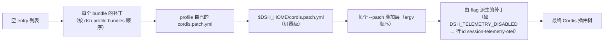

- `composeEntries(layers)` 就是**一次** `applyEntryPatches([], structuredClone(layers.flat()), warn)`，与 boot 时 include 执行的调用完全相同 —— 所以 `--dump-config` 看到的正是会挂载的东西，不会漂移。
- 后层**按行**获胜；补丁**整体替换目标行的 `config`**（不做深合并），因此每个补丁行必须重述它拥有的所有键；补丁可以 `insert` 新行。
- `--dump-default-config` 省略第 2–4 层 —— 当 `cordis.patch.yml` 损坏时，这是唯一不会去解析它的恢复诊断入口。
- `cordis.yml` 的 `config` 与 entry 的 `disabled` 允许 `!!js` 表达式（**不是 `!js`**），其他元数据保持字面量。
- **Patch reload 生命周期**：web profile 是 `live`（launcher 确保 `ctx.get('hmr')`/`ctx.get('timer')` 存在，并对 profile 补丁与 home 补丁调 `watchUserPatches()`）；`headless` / `sdk` / `sdk-minimal` / `acp` 是 `startup`（一次性应用，因为替换一个一次性或 stdio 应用的依赖会使其生命周期失效）；自定义 profile 默认 `live`。

**模块解析是双锚点的**：`resolveBundleDir(binName, packageName, installAnchor, profileDir)` 先按 **dsh 安装锚点**解析，再按 **profile 目录**解析。`healProfilesModuleFallback()` 维护 `$DSH_HOME/profiles/node_modules`：plain Node 得到每个依赖闭包包的 symlink；**打包后的可执行文件得到真实 ESM proxy**（OS symlink 无法进入 pkg 的 `/snapshot` FS）。仅被选中的外部 bundle 携带的包，经 dsh 自有目录 `.dsh-module-fallback` 链接进当前 profile 的 `node_modules`。

#### 启动调用链

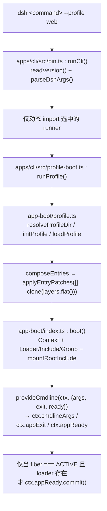

`boot()` 还会：把 `ctx.baseUrl` 设为根配置目录；提供 `ctx.dshHomePath` 让 Loader 的 `!!js` 表达式能调 `dshHomePath('sessions')`；`addHarnessSourceSection()` 追加 `HARNESS_SOURCE_SECTION` 系统提示段；`$DSH_SNAPSHOT=replay` 时把 `cordis.yml` 换成同目录的 `cordis.snapshot.yml`。

#### 五个随附 profile 的实际挂载

来源：`packages/boot/app-boot/src/profile.ts:105`（`PROFILE_TEMPLATES`）与各 bundle 补丁

| Profile | Bundle 层 | patchReload | 实际挂载要点 |
|---|---|---|---|
| `web` | `dsh-base` + `dsh-web-app` | `live` | dsh 核心 **加上浏览器面**：`web-startup`、`webserver`、`web-runtime`、`client-hmr`、`connection`、`modules`、`file-upload`、`api-remotes`、四个 `*-controller`、host `directory-picker(-auto)`、`plugin-inventory`、`open-in-app` + `ui-open-in-app`、`code-runtime`、`message-feedback`、`session-log-download`、`session-stats`、`session-turn-outline`、`agent-presets`，以及整个 `dsh.client` 浏览器 roster。**agent 平面在此被显式关闭**：`tool-bash`、`tool-fs`、`tool-web`、`tool-todo`、`tool-subagent*`、`tool-goal`、`plan-mode`、`compaction-basic`、`command-compact`、`tool-result-pruner`、`workflow-worker-thread`、`tool-workflow`、`tool-ralph`、`agent-instructions`、`skill-filesystem`、`tool-skill` 等全是 `disabled: true`，改由**每个 session 挂载一个 preset**。`ui-schedule` 也是禁用出厂 |
| `headless` | `dsh-base` + `dsh-headless` | `startup` | dsh 核心 + `code-runtime` + `headless-startup`（提供 `headlessStartup`）+ `headless-runner`（`inject: [headlessStartup]`，`task: !!js ctx.headlessStartup.task`）。**无 host、无 HTTP server、无 Web runtime、无浏览器插件** |
| `sdk` | `dsh-base` + `dsh-sdk-app` | `startup` | dsh 核心 + `sdk-app-startup` + `sdk-jsonrpc-server`（`inject: [sdkAppStartup, loader]`）。`session-title-llm` 禁用。**stdout 专供 JSON-RPC** |
| `sdk-minimal` | 仅 `dsh-sdk-minimal` | `startup` | **故意例外**：不叠加 `dsh-base`，单 bundle 拥有完整显式树（显式 `apiKeyEnv`、`sandbox: danger-full-access`、`compression: none`、`maxTokensAsSuccess: false` 等） |
| `acp` | `dsh-base` + `dsh-acp-app` | `startup` | dsh 核心 + `acp-app-startup` + `acp`（`inject: [acpAppStartup]`）。`session-title-llm` 禁用。**stdout 专属于 ACP** |
| `desktop` | 不走 CLI profile | — | 由 `apps/desktop-host` 直接 `boot()`：`dsh-base` + `dsh-web-app` + 已启用的第三方插件，再叠 Electron overlay（禁用 `web-startup`/`webserver`/`web-runtime`/`client-hmr`/`open-in-app`，插入 native 目录选择器，并把 `agent-presets.roots` pin 到 `<dshRoot>/config/agent-presets` 且 `trust: 'system'`）。CLI **完全拒绝** `desktop` profile 名 |

缺失的 profile：`web`/`headless`/`sdk`/`sdk-minimal`/`acp` 首次使用时自初始化；其他名字则大声失败并提示 `dsh plugin --profile <name> add <package>`。

`dsh-base`（`packages/bundle/base/cordis.patch.yml`）是 web / headless / sdk / acp 的共享首层，84 个插件行（487 行 YAML）：timer、hmr（禁用）、llm、session、session-log-deepseek、**typert registry + loader + gateway**、session-title(+llm)、agent、jobs、llm-retry、settings-file、credentials-local、llm-pi-ai、session-persistence-jsonl、attachment-local、session-query-sqlite、session-projection、storage*、subagent*、tools、system-prompt、agent-loop、fs-sandbox、llm-deepseek 及工具/命令行。完整清单由 `apps/cli/composition.md` 生成并维护。

---

### 1.4 核心脊柱（core spine）

来源：`docs/architecture.md#core-packages`、`docs/subsystems/core.md`

| 包 | 职责 | `ctx` key |
|---|---|---|
| `core/session` | 追加式 `SessionEvent` 日志与内存 store | `ctx.sessions` |
| `core/system-prompt` | Prompt 段落与工具 schema 装配 | `ctx.systemPrompt` |
| `core/tools` | scoped 工具注册表 + 受守卫执行管线 | `ctx.tools` |
| `core/agent` | `Agent` 接口、活体注册表、`agent/*` 事件 | `ctx.agents` |
| `core/agent-loop` | 实现该接口的默认驱动器 | `ctx.agentLoop` |
| `core/scope` | per-agent scoped 注册原语 | 纯库，无 key |
| `llm/llm` | Message / ContentBlock / StreamChunk 词汇 + 适配器接缝 | `ctx.llm` |

一次 turn 穿过这六个包：驱动器领取排队 prompt → 在 session 日志上开启 turn → 经 `systemPrompt` 装配请求前缀并从日志派生历史 → 经 LLM 接缝流式请求 → 经 `tools` 分发工具调用 → **把每个模型可见事实写回日志**，下一步再从日志派生。

---

### 1.5 能力接缝（Capability Seams）

来源：`docs/capability-seams.md`（生成物，`pnpm run gen-doc-graphs`）

一个接缝 = Service Definition + 一个或多个 Provider + 一个或多个 Consumer。**换一个 Provider 就能改变整个产品的行为**：filesystem 与 subprocess provider 共享同一个执行世界，把它们指向远端沙箱，Bash、PTY、LSP 会一起搬过去，无需为它们各自分叉。

```mermaid
flowchart LR
  subgraph DEF["Service Definition（声明 ctx.key）"]
    FS["fs → ctx.fs"]
    SH["shell → ctx.shell"]
    SP["subprocess → ctx.subprocess"]
    SB["sandbox → ctx.sandbox"]
    TM["terminal → ctx.terminals"]
    LLMS["llm → ctx.llm"]
    WEB["web → ctx.web"]
    LSPD["lsp → ctx.lsp"]
    SUB["subagent → ctx.subagents"]
    JOB["jobs → ctx.jobs"]
    WF["workflow → ctx.workflowEngine"]
    CR["code-runtime → ctx.codeRuntime"]
    CP["compaction → ctx.compaction"]
    SPERS["session-persistence → ctx.sessionPersistence"]
    ST["storage → ctx.storage"]
    SET["settings → ctx.settings"]
    CRED["credentials → ctx.credentials"]
    ATT["attachment → ctx.attachments"]
    SPILL["spill → ctx.spillStore"]
    SK["skill → ctx.skills"]
  end

  subgraph PROV["Provider（实现）"]
    P1["fs-local / fs-sandbox / fs-e2b"]
    P2["bash-local / bash-sandbox / pwsh-local / pwsh-sandbox"]
    P3["subprocess-local / subprocess-e2b"]
    P4["sandbox-local / sandbox-windows-acl"]
    P5["terminal-bash"]
    P6["llm-deepseek / llm-pi-ai / llm-replay"]
    P7["web-search-{deepseek,exa,perplexity} / web-fetch-http"]
    P8["lsp-stdio"]
    P9["subagent-{spawn-in-process,fork-in-process,acp,codex,claude-code,dsh-sdk}"]
    P10["jobs-local · workflow-worker-thread · code-runtime-worker-thread"]
    P11["compaction-basic · session-persistence-jsonl · storage-{json,sqlite} · settings-file"]
    P12["credentials-local · attachment-local · spill-local · skill-filesystem"]
  end

  subgraph CONS["Consumer（通常是模型工具）"]
    C1["tool-fs · tool-fs-search · tool-str-replace-editor · tool-present"]
    C2["tool-bash · tool-pwsh · tool-terminal · tool-lsp"]
    C3["tool-web · tool-subagent · tool-subagent-control · tool-jobs · tool-skill"]
    C4["tool-workflow · tool-ralph · tool-goal · tool-todo · tool-ask-user · tool-cordis"]
    C5["tool-session-query · hooks-{claude-code,codex} · 各 UI 包"]
  end

  DEF --> PROV
  DEF --> CONS
```

**几处容易误读的真实形态**（均已核对源码）：

- `fs` 接缝的**组合方式是替换而非叠加**：加载 `fs-sandbox` **instead of** `fs-local`。`fs-sandbox` 覆写 `writeText`/`editText` 做策略栅栏，读/列/元数据全部继承，任何模式都可读。
- `fs-observation-policy` **不是 Service Provider**：无服务键、无 `inject`、无 `Config`，只是 `fs/write-intent` / `fs/edit-intent` / `fs/observed` 的事件监听者，状态在每次 `apply` 一个实例的 `WeakMap` 里（**不持久化**，resume 后必须重新读）。准确的表述是"一个 policy backend（`fs-sandbox`，注册 `ctx.fs`）+ 一个 event policy plugin（`fs-observation-policy`，不注册服务）"。
- `spill-local` **不是内容寻址**：文件名 = 随机 6 字节 hex + 转义后的 `suggestedName`，`open(path,'wx',0o600)` 独占创建；无摘要目录、无去重、无对象池。`SpillStore` 契约只承诺一个 opaque locator。
- `attachment` **没有元数据 sidecar**：磁盘上只有内容寻址的字节对象；`mediaType/width/height/bytes/name` 只存在于 session log 的 `ImageAttachmentRef`/`FileAttachmentRef` 中。
- `workspace` 包**不调用 `ctx.fs`**：只用 `node:fs/promises` 的 `realpath`/`stat`，共享事实是 `SessionHeader.cwd`。
- `ctx.sessionTitle` 是**单槽** `register(provider)`，第二个注册抛错；不存在 `ctx.sessionTitleProviders`。

完整清单（含每个 `ctx.key` 的角色、Owner、实现包、直接消费方）见 `docs/capability-seams.md`，由 `scripts/gen-doc-graphs.ts` 从源码中的 Cordis 服务声明生成，并有"三角完整性"守卫。

---

### 1.6 事件分类与 turn / step 生命周期

来源：`docs/architecture.md#turn-flow`、`docs/agent-lifecycle.md`、`docs/event-producer-consumer.md`

**事件分三个域**，选对域是多数改动的第一个决策：

- **Session 事件** —— 追加到日志并经 `session/event` 广播的**持久事实**。必须跨 reload 存活的事实用它。
- **Agent 事件**（`agent/*`）—— 携带活体 `Agent`：inbox、step、status、request、validation、continuation。用于观察或拦截在途工作。
- **能力事件** —— 把策略与适配器挂到接缝上（`fs/*`、`tools/*`、`telemetry/*`），无需 import 主循环。

> `turn/*`、`step/*`、`system/message`、`user/message`、`assistant/message`、`assistant/attempt`、`tool/*` 是**持久 session 事件**；其余是跨三个域的**活体扩展点**。
> `agent/pre-step`、`agent/request`、`llm/stream`、`tools/{pre-execute,execute,post-execute}` 是 **waterfall**（监听者必须 `next()`）；`agent/turn-stopping` 是 **serial**，没有 `next()`。

**术语**：**step** = 一次模型请求 + 它触发的工具调用；**turn** = 零或多个 step，在第一个输入被领取前打开，在不再欠任何工作时关闭。

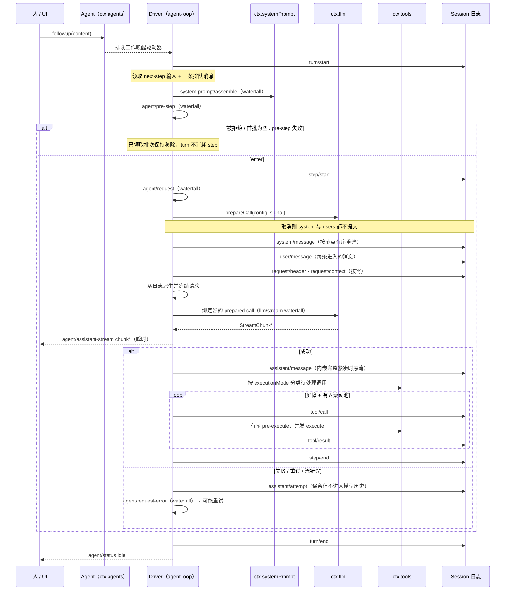

**输入通过唯一 inbox 到达驱动器**。部分消息立即唤醒它；注入的 context 留在 inbox，直到有别的消息唤醒。`agent/pre-step` 决定被接受的输入，监听者可改写或拒绝；被拒绝或空的首批声明会在没有 step 的情况下关闭一个持久 turn。

---

### 1.7 工具执行管线

来源：`docs/tool-execution-pipeline.md`

工具调用的策略、hooks、沙箱、文件系统守卫、结果改写、最终结果观察与 UI 渲染，全部通过 waterfall 挂载，**不修改主循环**。

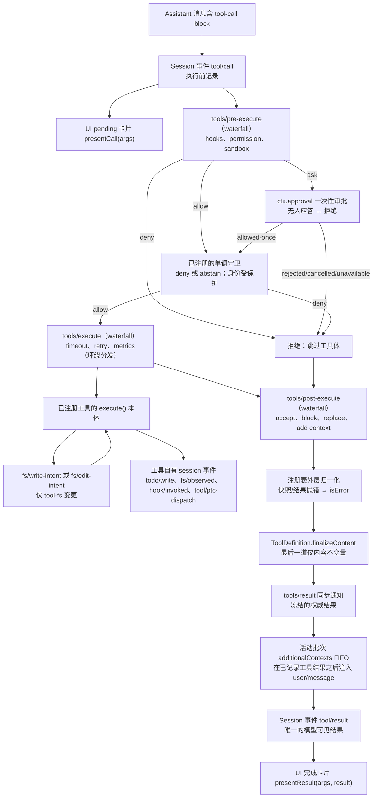

关键点：通用 pre/post waterfall 承载 hooks 与审批策略；审批早于单调守卫解决；必须不可重排的 owner 策略保留为已注册守卫；超时这类环绕分发关注点包裹 `tools/execute`。PTC（Programmatic Tool Calling）模式的 `run_code` 传输与其序列化子调用走同一条管线。

---

### 1.8 会话日志与"模型可见即可重建"

来源：`docs/architecture.md#session-log`、`docs/session-format-status.md`、`packages/core/session/src/*`

`class Session` 是 appender 与 derived state 的唯一 owner；它**不做持久化** —— 持久化是插件的事（订阅 `session/event`，在 `session/flush` 时排空）。

**append 的拒绝规则**（被拒绝的 append 不改日志、不改 derived state、不发事件）：任何 `header.system`；恰好为空的 optional request-header 字段（`tools: []`、`adapterDefaults: {}`）—— 一律拒绝而**不归一化**；`tool/result.data.error` 仅当 `message.content[0].isError === true` 时允许。surface 事件（`system/message`、`user/message`、`assistant/message`、`tool/result`）必须带 `surfaceOp`（typed event 与 append input 两处），replacement 只允许 `{op:'replace', startSeq, endSeq}`。

**fail-closed 的未知事件**：`SessionEvent.ignorable?: true`。读取时遇到本 build 不认识的类型，若没有 `ignorable: true`，**必须拒绝重建整个 session**。默认 required 意味着"忘记标记"会过度拒绝（不便），而不是静默恢复一个被掏空的 session —— 这是刻意的取舍方向。

**模型可见性由三个强制点保证**：

1. `foldRequestHeader(events, from?)` 纯 fold 最后一条 canonical `request/header`，`canonicalHeader` 把空 tool 列表规范为字段缺席 —— 任何持日志者都能重建任意请求的 header。
2. checkpoint policy 在语义边界 flush（见下）。
3. 未知 required 事件 fail-closed，避免"无法重建"被降级成"重建出错的 session"。

**崩溃恢复**：`interruptedTurnClosers(events)` 返回确定性的合成收尾 —— 未匹配的 tool call 先补一条 error `tool/result`（`TOOL_NOT_STARTED` / `TOOL_OUTCOME_UNKNOWN`），再补开放的 `step/end`，最后补 `turn/end {reason:{kind:'interrupted'}}`；seq 继续日志，timestamp 复用最后一个真实事件。

**`deriveMessages()`**：遍历 surface node（每 node 一个 log seq），对每个 node 调 `deriveEventMessage`；非 surface 事件与空内容的 `assistant/message`（只承载 usage 的 max-tokens step）映射为 `null`。**同一函数**被外部 reconstructor 用来 fold 任意前缀，从而精确重建任何请求当时的 messages。每个 node 只投影一次（成本 O(新增节点)），`replaceGeneration` 变化时整表重建；返回新数组快照但 `Message` 对象共享且 deep-frozen。

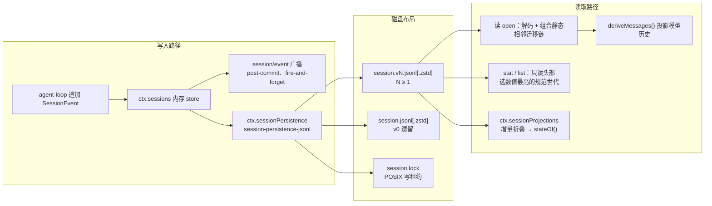

**格式版本与相邻迁移**（v0 → v1 → v2 → v3）：

- 消费者只知道当前逻辑格式。仅头部的 `stat` / `list` 重新扫描 Session 目录，选取数值最高的规范世代，并翻译受支持的历史头部（不加载事件、不发布后继）。
- 存储 session 的 `open` 选中同一世代，拒绝未来版本，或**解码并组合一次静态相邻迁移链**后返回校验过的当前逻辑事件。
- 写 open 会先编码、校验、并以独占方式把最终版本命名的后继**发布在原文件旁边**（原文件不变）。**已提交的世代路径永不重命名、替换或删除**。
- 分工：**物理分帧归 `session-format` 库**（每版本一个 frozen codec）；**每个迁移步骤归各自的 `session-format-v*-to-v*` 包**；**链编译归 `chain.ts`**（构造期校验唯一无缝隙相邻顺序）；**装配归生成的 `session-format-catalog`**；JSONL provider 叠加压缩后缀与世代选择。

**checkpoint policy**（`session-checkpoint-policy`，83 行，无 Config、无服务、无状态）在三个语义边界 flush：`llm/stream` 返回 `afterCheckpoint` async generator（**先 flush 再 yield**，使 adapter stream 在已记录请求前缀持久化前根本不构造）；`tools/execute`（跳过无 agent 或子调用，flush 后若已 abort 则返回 `TOOL_ABORTED_BEFORE_DISPATCH`）；`agent/pre-step`。首 step 是文档化的 no-op。

**投影接缝 `ctx.sessionProjections`**：`ProjectionDefinition` 的 `init(header, inheritedEventCount)` **必须**从轻量 metadata 与精确 fork inherited cut 出发（不得从 `firstLiveSeq` 或 `session/end-seed` 推断）；`apply(state, event)` 必须**同步**，对不关心的事件必须返回**同一 state 引用**（同引用 = 零下游工作）。驱动器是急切的，所以任何已注册 unit 的值按构造都是 current。宿主读取者必须在激活时 require 该服务，或在缺失时显式失败 —— **不得静默降级**。

---

### 1.9 Web GUI 运行时拓扑

来源：`docs/api-gateway.md`、`docs/subsystems/web-client.md`、`packages/{host/webserver,client/connection,client/modules,api/gateway}/src`

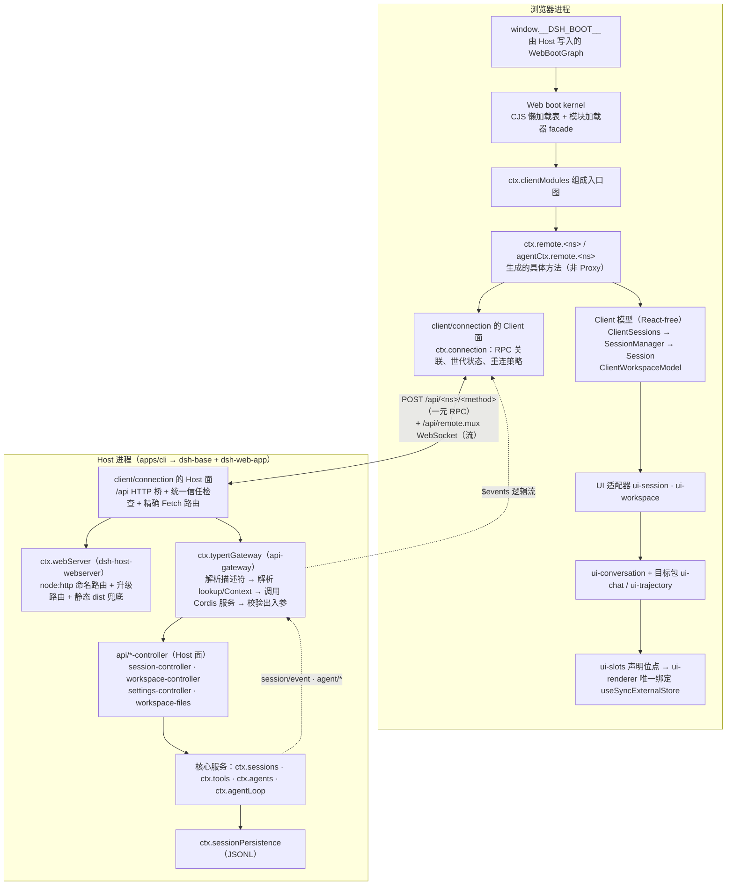

**浏览器启动两阶段**（`packages/client/web/src/boot.ts`）：

1. **模块阶段** —— 等待 `globalThis.__DSH_BOOT_READY__`；`window.__ModuleLoader__.create({ boot: window.__DSH_BOOT__, staticModules, ...__DSH_TRANSPORT__ })`；预取 `immediately` 层。
2. **插件阶段** —— `ctx.plugin(Loader)`，`loader.internal = modules`，`Promise.all(manifest.plugins.map(row => loader.create({name: row.id})))`，断言所有 entry 激活，最后 `ctx.inject(['uiRenderer'], s => s.uiRenderer.mount(container))`。

模块系统是**懒 CJS 表**：脚本执行只注册工厂，模块体（以及 `<style data-plugin data-plugin-css>` 注入）在首次 `require` 时才运行。`PLATFORM_MODULES` 是静态链接白名单（`react`、`react-dom`、`@deepseek-ai/cordis`、`dsh-client-store`、`dsh-client-ui-{slots,primitives,dockkit}`）。

**`dsh.client` 行如何变成浏览器代码**（`packages/client/modules`）：Host 半订阅 `internal/plugin` 维护 dirty 集，经 Loader 解析包名、校验 `dsh.client`（要求 `platform: 'web'`）、解析 `exports["./client"]`（缺失则报 *"run `pnpm run build` before launch"*），再 `orderByModuleGraph()` 按 `dsh.client.external` 拓扑排序，产出 `WebBootGraph`。**Bundle URL 只有组合（combo）形式**：

```
/plugins/??<id1>/client.js,<id2>/client.js&rev=<12 位十六进制产物哈希>
```

`MAX_COMBO_URL_BYTES = 3 * 1024` 是分 batch 的硬上限。**没有逐 id 路由**：直接 `GET /plugins/<id>/client.js` 会 404，该字符串只作为 source-map 的 `fallbackSource` 标签存在。

**精确的路由表**（除一元 Remote 外）：

| 路由 | kind | 归属 |
|---|---|---|
| `/api` | prefix | `client/connection` —— 信任栅栏 + 共享 FetchHandler |
| `/plugins` | prefix | `client/modules` —— 客户端 bundle combo 路由（仅 GET/HEAD，仅精确 `${pathname}${search}` 键，`immutable` 缓存） |
| `/plugins/events` | exact | `client/hmr` —— SSE（`content-type: text/event-stream`，帧 `{type:'graph'\|'rebuilt'}`） |
| `/api/file` | exact GET/HEAD | `api/session-controller` —— 已认证图片读取 |
| `/open-in-app/{apps,icon,open}` | exact/prefix | `host/open-in-app` |
| `/.dsh/remote-stream` | exact | `apps/desktop-host` —— Electron NDJSON 流载体 |
| fallback 席位 | — | `host/frontend-static` —— SPA dist |

**两条线缆机制（都不是 JSON-RPC）**：

- **一元 RPC 走 HTTP POST**：`POST /api/<namespace>/<method>`，请求体 `{ type:'client-request', rpcId, method, payload }`，响应 `{ type:'server-response', rpcId, result: {ok:true,value} | {ok:false,error} }`。Client 侧 `RemoteResult<T>` **对载体故障永不 reject**，只有装配错误才 reject。
- **流走单一 WebSocket mux**：`REMOTE_STREAM_MUX_PATH = '/api/remote.mux'`，作为 `WebUpgradeRoute` 注册，栅栏为 `connection.requestRejection(req)` → 401/403。Client→Host 帧 `open`/`cancel`，Host→Client 帧 `item`/`error`/`end`，以 `streamId` 复用一条物理 socket。心跳 `DEFAULT_WEBSOCKET_HEARTBEAT_INTERVAL_MS = 2000`，连续错过 `MAX_MISSED_HEARTBEATS = 2` 次才终止（收到 pong 立即重置计数）。
- **转发的 Host 事件走 `$events` 逻辑流**：`REMOTE_EVENT_STREAM_ENDPOINT = '$events'`，`$events/result` 承载 waterfall 结果的 HTTP 回程。转发白名单只有**一个归属**：`packages/api/remotes/src/remote-events.ts` 的 `API_REMOTE_FORWARDED_EVENTS`（`agent-preset/selected`、`approval/request`、`api-session/*`、`commands/change`、`credentials/reference-updated`、`goal/activation-changed`、`cordis/*`、`llm/adapters-updated`、`settings/document-updated`、`user-questions/request`）。waterfall 条目**必须直接携带它的 Agent**（否则抛 `TypeError`）。

**分层职责**（`docs/subsystems/web-client.md`）：

| 层 | 主要 owner | 职责 |
|---|---|---|
| Host 应用 | 业务服务 + `packages/api/*-controller` Host 面 | 权威状态、持久化、变更顺序、访问策略、流生产 |
| 传输与 API 装配 | `client/connection`、`api/gateway`、`api/remotes` | 建立 Client 世代、暴露生成的 `ctx.remote` 与流、转发选定 Cordis 事件 |
| Client 模型 | `api/session-controller/client`、`api/workspace-controller/client` | React-free 的 Host 状态镜像、解流/单次调用竞态、对象身份与订阅 |
| UI 适配器 | `client/ui-session`、`client/ui-workspace` | 把模型 observable 转成根级/Session 级标准 Slot 源，不接管业务状态 |
| 会话数据 | `client/ui-conversation` + 目标包 | 组装标准事件与历史 Assistant 运行成独立目标快照 |
| 组合与渲染 | `client/ui-slots`、`ui-renderer`、`ui-layout`、功能 UI 包 | 声明扩展位点、派生 props、绑定 observable、挂载最终树 |

**依赖方向**：Host 状态 → Remote 传输 → Client 模型 → UI 适配器 → Conversation/展示 → Slots → React。展示组件**绝不**接收 Cordis `ctx`、传输对象或另一个功能插件的实现。

**重连语义**（物理与逻辑恢复分离）：网关 mux 恢复物理 WebSocket；每个 `RemoteStream` 在 Connection 发布可用世代时重开自己的逻辑源。承载失败可重试，而业务错误、畸形起始项或协议违规对拥有它的逻辑流是终态的。持久 Session 日志从每个世代的开启快照替换窗口；控制流与 Workspace 流保留最后发布值后在重连时原子替换；普通转发通知不重放。

---

### 1.10 Typert：跨进程类型化 RPC

来源：`docs/api-gateway.md`、`packages/typert/*`

业务服务用 `@Remote` / `@RemoteScope` 装饰器选择暴露给 Client 的方法。**未标注的方法不进入生成的 Client 类型与运行时贡献**。

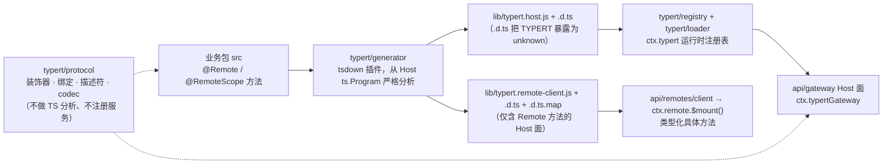

四个包的职责边界：

| 包 | 职责 | ctx key |
|---|---|---|
| `generator` | 构建期：生成反射、schema、Remote 描述符（`typertPlugin({ mode:'workspace', faces:['host'] })`） | — |
| `protocol` | 装饰器、线缆描述符、codec、merge-extensible 映射；不做 TS 分析、不注册服务 | — |
| `registry` | 运行时存储生成的包反射与活体 Zod schema，加 lookup 与 Context provider 注册表 | `ctx.typert` |
| `loader` | 自动把 Loader entry 上的生成产物注册进 registry | 消费 `ctx.loader`、`ctx.typert` |

- Host 业务对象（如 `Agent`）不能直接过线：业务包须用 `TypertLookupMap` 声明其线缆身份（`agent` 参数 → `agentId` 字段），并在运行时用 `ctx.typert.lookups` 注册默认解析 provider。
- 取消：Host 签名最后一个参数须为全局类型的 `signal: AbortSignal`，它进入描述符而不进入 `args`。
- **SRC 开发回退**：Host 经 `node --import tsx/esm` 从源码启动时不执行 Typert 编译器插件；标准装饰器初始化器仍会在 Service prototype 上记录版本化描述符，Gateway 据此构造较弱的临时描述符。SRC 不读 TS 类型、不生成 Zod schema、不支持解构/默认值/剩余参数。Client 永远不发现运行中 Host 的装饰器。
- 生成器会校验每个贡献包的 manifest：`./typert`、`./client/typert`（有 Remote 方法时还有 `./remote`）必须指向确切文件，且 `files` 必须包含它们。
- **边界**：Remote 只处理一元方法调用。Session 事件流、分页、增量 reduce、投影、实体子流需要独立数据协议，**即使用同一个 Connection 也不得伪装成 Remote 方法**。API 层组织为 `remotes → gateway → connection → webserver`。

---

### 1.11 桌面应用（Electron）

来源：`apps/desktop/src/{main,host-process,ipc,host-protocol}.ts`、`apps/desktop-host/src/index.ts`

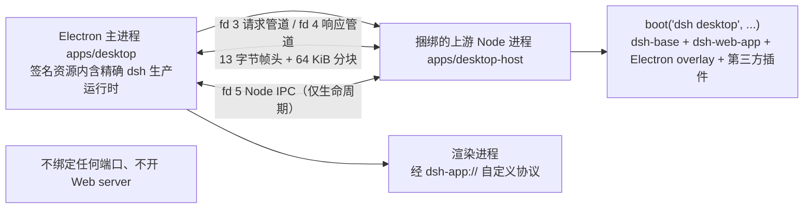

- **`dsh-app://` 自定义协议，不是 `file://`**。`main.ts` 在模块顶层 `protocol.registerSchemesAsPrivileged([{ scheme:'dsh-app', privileges:{ standard:true, secure:true, supportFetchAPI:true, corsEnabled:false, stream:true, codeCache:true } }])`，再 `protocol.handle(SCHEME, ...)`：`hostname === 'shell'` → 从 `renderer/` 提供桌面自有页面（遍历越权 → 403）；`hostname === 'app'` → 转发给后端 Host（后端未就绪 → 503）。Host 侧把 `dsh-app://app` 再分三路：`/.dsh/remote-stream` → NDJSON 流 RPC；`/api/*` → `connection.createSharedFetchHandler('/api')`；其余 → 服务于 `dsh-web-frontend/dist`。
- 窗口安全：`nodeIntegration: false`、`contextIsolation: true`、`sandbox: true`、`webSecurity: true`、拒绝 `setWindowOpenHandler`、`will-navigate` 只允许 `dsh-app:`。
- **帧协议**（`DESKTOP_HOST_PROTOCOL_VERSION = 3`）：`FRAME_MAGIC = 0x44534833`（"DSH3"）+ type u8 + streamId u32BE + payloadLength u32BE = 13 字节头；`DESKTOP_PIPE_CHUNK_BYTES = 64 KiB`；控制帧上限 1 MiB。请求帧 `START/DATA/END/CANCEL`，响应帧 `START/DATA/END/ERROR`。子进程 stdio 为 `['ignore','pipe','pipe','pipe','pipe','ipc']`，env 被清除 `NODE_OPTIONS`、`NODE_PATH`、`/^DSH_DESKTOP_/`、`/^(?:npm|pnpm|corepack)_/i`。
- **13 个 `ipcMain.handle` 通道**（前缀 `dsh-desktop:`，全部 `invoke`，无 `on`/`send`）：`localeGet`、`plugins{List,Add,Remove,Update,Toggle,DisableAll}`、`backend{Status,Retry}`、`applicationRestart`、`configurationReset`、`updates{Check,Install}`；另加 2 条主→渲染推送 `backendState`、`updatesState`。`preload.ts` 暴露完整 `window.dshDesktop`；**`preload-app.ts` 只在 `protocol === 'dsh-app:' && hostname === 'shell'` 时暴露**，应用文档（`dsh-app://app`）只拿到 `{ protocolVersion: 1 }`。
- 桌面 Host **不做流传输 WebSocket**：`DESKTOP_TRANSPORT_SCRIPT` 注入 `index.html`，设置 `globalThis.__DSH_TRANSPORT__ = { ownsHost: true, openStream(...) }` 走 `POST /.dsh/remote-stream`，Host 用 `ctx.typertGateway.wireStream.open(...)` 消费并回 `application/x-ndjson`。**一元 RPC 仍走 `/api/*`**。
- `apps/desktop` 与 `apps/desktop-host` **不共享 Cordis context**：`apps/desktop/src`、`renderer/`、`scripts/` 中零 `ctx.*` 调用；所有 Cordis 组装都在 `apps/desktop-host/src/index.ts` 的 `boot()` 里。
- 保留目录 `$DSH_HOME/profiles/desktop` 存放外部插件与宿主包链接；兼容升级保留插件文件并刷新链接，而不重新安装核心依赖。**只有 shell 拥有的 UI** 才能通过捆绑的 pnpm 及其私有 `$DSH_HOME/desktop/pnpm/store` 执行插件事务。

---

### 1.12 SDK / ACP / Python

| 通道 | 包 | 形态 |
|---|---|---|
| TypeScript SDK | `sdk/protocol`、`sdk/client`、`sdk/server` | 换行分隔 JSON-RPC over stdio。Client 解析同版本 `dsh` 依赖并选择 `sdk` profile |
| ACP | `acp/acp`（+ `bundle/acp-app`） | 自动化专用的 Agent Client Protocol server：创建/列出/恢复/关闭会话、挂载标准 MCP server、选模型、发文本与图片 prompt、接收语义更新、应答权限提示、取消工作 |
| Python SDK | `python/sdk` | 客户端包，启动 `dsh --profile sdk` 并显式指定 Harness home |
| Python 运行时 wheel | `python/sdk-runtime` | 把普通 `dsh` CLI 打包为 `deepseek-harness-sdk-runtime-<platform>-<arch>` |

**应用启动的唯一性**：只允许 `dsh` profile 启动受支持的 Node 应用。包 bin、demo、公开 SDK argv 逃逸都被禁止 —— `scripts/verify-application-entrypoints.ts` 保持每个 package bin、可执行源码与根 demo 处于显式分类中，并拒绝绕过 `dsh` 的 Node 应用路径。

---

### 1.13 安全与权限模型

来源：`docs/subsystems/{sandbox,approval,permission-presets}.md`

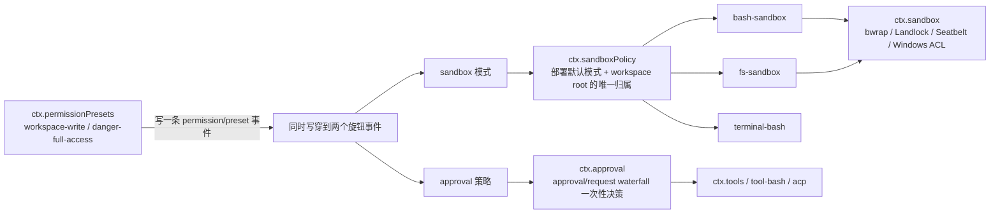

- 沙箱把子进程限制到文件效果策略：`read-only`、`workspace-write`（仅在 session workspace 下写）、`danger-full-access`。
- 消费方交出**即将 spawn 的精确 argv**；同世界后端在 per-call 策略下包裹它并报告执行结果。
- 审批是经 `approval/request` waterfall 分发的一次性权限决策；**应答者是监听者**，缺失即 fail-closed 为 `unavailable`。
- `sandbox-policy` 是两个强制族（bash 与 fs）共同读取的唯一归属，**确保两者不会限制到不同的根目录**。
- `fs-sandbox` 在 `workspace-write` 下会**立刻重新 canonicalize** 目标路径（捕捉检查期间被换掉的 symlink 祖先），再对 `writableRoots` 逐个 `isPathUnder`，最后用**新 target** 去写 —— 避免 check-here-write-there。定位是**策略栅栏（trusted code over model-controlled path），不是内核边界**。

---

### 1.14 `/api` 请求信任检查链（Trust Fence）

来源：`packages/client/connection/src/{api-request-trust,loopback-hostname,rpc-host}.ts`

`/api` 的守卫由**两道独立检查**串成（`rpc-host.ts:98-99`）：先信任 fence（失败 403），再浏览器认证（失败 401）。

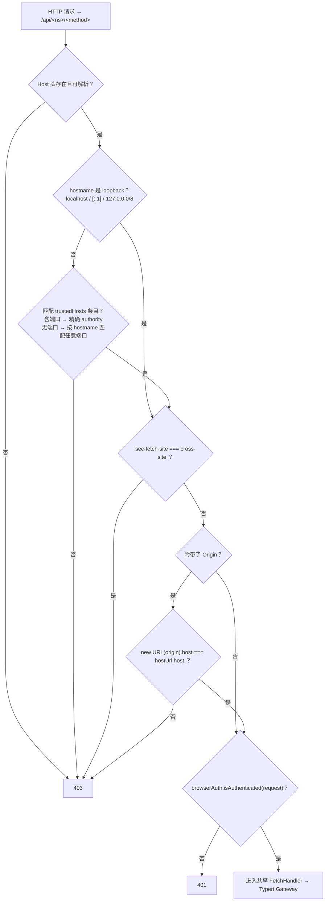

设计要点（全部取自源码注释）：

- **Host fence 施加于每个请求，包括非浏览器请求**。明文 HTTP 下浏览器对读请求（图片、导航）既不附 `Origin` 也不附 Fetch-Metadata —— 那些头只发往"可信目的地"。因此**无标记请求仍可能是被 DNS rebinding 的浏览器读**，而 `Host` 是 rebinding 唯一无法伪造的头。所以这里没有"标记捷径"。
- `trustedHosts` 条目必须是裸 authority（`host` 或 `host:port`）且 WHATWG 解析后保持不变。任何会被解析悄悄改写的形状都在**加载时大声失败**（`assertTrustedAuthority`）：带路径、带 `user@`、尾随空白、悬空冒号或补零端口（会把"精确端口"授权悄悄放宽到所有端口）、非规范写法（`0x7f.0.0.1`、百分号编码、未加括号的 IPv6）；IDN 主机须用 punycode 声明。
- `Origin` **缺失是允许的**（Host fence 已经约束了请求）；字面量 `"null"`（沙箱 iframe、`file:` 页面）是不透明源，被拒。
- **网络可达性与认证不属于本 fence 的职责**：绑定策略属于 webserver 配置，且本 fence **不是认证层**。
- ⚠️ **本机 checkout 源码是严格比较**（`origin.host === hostUrl.host`，端口必须一致）。`【代码更新日志】.md` 记录的 "loopback 放宽端口" 补丁只落在全局 npm 安装产物的 `lib/index.js`，**尚未回填到本仓库源码**（该日志的 TODO 第 1 条正是此事）。

---

## 2. 代码目录结构说明

### 2.1 仓库根目录

```
deepseek-harness/
├── apps/                     # 4 个应用外壳（cli / web / desktop / desktop-host）
├── packages/                 # 268 个 npm 包，按 50 个能力分组组织（核心）
├── vendor/                   # 9 个源码 vendored 的 Cordis 框架包（已 rescope 到 @deepseek-ai）
├── native/system/            # @deepseek-ai/node-addon-system 原生插件系统源码
├── python/                   # Python SDK 与运行时 wheel
├── benchmarks/               # 性能基准与 CI 性能门禁
├── snapshots/                # 录制会话回放快照（session / sdk / web / acp）
├── scripts/                  # 215 项生成器与校验门禁
├── website/                  # docs/ 的 VitePress 投影
├── docs/                     # 双语文档（architecture / subsystems / cookbook / cordis-* / i18n / user / postmortem）
├── .agents/                  # Agent Notes（proposed / implemented / rejected / archived）+ 12 个 skills
├── .github/                  # 21 个 CI/发布 workflow、issue 与 review 策略
├── patches/                  # pnpm patch（electron osx-sign / yao-pkg / node-pty）
├── AGENTS.md (→ CLAUDE.md)   # 常驻规则；packages/AGENTS.md、docs/AGENTS.md 为其子树细化
├── package.json              # pnpm workspace 根，所有脚本入口
├── pnpm-workspace.yaml       # workspace 与 linkWorkspacePackages（vendor 依赖解析）
├── tsconfig.json             # 方案根（solution root），files: [] + 指向两个聚合的 references
├── tsconfig.host.json        # Host 聚合程序（226 个 project reference）
├── tsconfig.client.json      # Client 聚合程序（69 个 project reference）
├── tsconfig.base.json        # 共享 compilerOptions + 412 条源码 paths 映射（无 include，作为解析 facade）
├── tsconfig.base.client.json # 浏览器编译设置（jsx、DOM libs、types: []）
├── tsdown.config.ts          # 运行时打包（tsc 产出 lib/types → tsdown 产出 lib/）+ Typert 插件
├── vitest*.config.ts         # 8 个测试配置（unit / coverage / e2e / snapshot / expected / web / bench / stress）
├── lefthook.yml              # worktree-local Git hooks（pre-commit / pre-merge-commit / pre-push）
├── .oxlintrc.json            # Oxlint 规则（另有 .oxlintrc.staged.json 快速档）
├── .jscpd.json               # 跨文件 TypeScript 克隆检测
├── pytest.ini                # Python 测试收集范围（testpaths = python/sdk/tests）
└── README.md / SAFETY.md / CONTRIBUTING.md / THIRD_PARTY_NOTICES.md / BENCHMARK.md / BRAND_GUIDELINES.md
```

### 2.2 `apps/` —— 应用外壳

| 目录 | npm 名 | 说明 |
|---|---|---|
| `apps/cli` | `@deepseek-ai/dsh` | **唯一受支持的 Node 应用启动器**。`bin: {"dsh": "lib/bin.js"}`。`src/` 只有 7 个文件：`bin.ts`（读版本、解析 argv、只动态 import 选中的 runner）、`args.ts`（launcher 旗标语法）、`profile-boot.ts`（profile 解析 + patch 分层 + boot + cmdline + 有界关闭 + appReady）、`plugin.ts`（`dsh plugin` pnpm 转发 + `dsh.profile.bundles` 对账）、`dump-config.ts`（不 boot、不评估 `!!js`）、`process-shutdown.ts`、`sdk-source.cordis.patch.yml`。另含 `reference/README.md`（CLI 行为权威参考）、`composition.md`（生成的组合图）、`config/examples/`（cordis / github-review / mcp-memory / schedule 示例） |
| `apps/web` | `@deepseek-ai/dsh-web-frontend` | 只做 Vite 构建：把 `packages/client/web` 这个 shell 库构建成 `dist/`，再由 `dsh web` 提供。`vite.config.ts` **拒绝独立构建**（*"bare Vite cannot inject window.__DSH_BOOT__"*）。含 `stress-tests/` 与 Playwright e2e 套件 |
| `apps/desktop` | `@deepseek-ai/dsh-desktop` | Electron 壳，**不参与 Cordis**。`src/` 19 个 TS 文件（main / preload / preload-app / ipc / host-protocol / host-process / backend-controller / paths / project-manager / runtime-tree / release / locale / single-instance / update-coordinator 等）、`renderer/`（桌面自有页面：startup、plugin-manager）、`scripts/`（27 个构建/打包/签名/公证/上传脚本）、`electron-builder.config.mjs` 是唯一打包配置 |
| `apps/desktop-host` | `@deepseek-ai/dsh-desktop-host` | 私有上游 Node 子进程，承载桌面 Cordis 树。`src/index.ts` 做 `boot('dsh desktop', ...)`、fetch handler、fd 3/4 帧、生命周期；`src/wire.ts` 是版本 3 的帧协议；`config/desktop.cordis.patch.yml` 是 Electron overlay |

### 2.3 `packages/` —— 50 个分组、268 个包

每个包都是 `@deepseek-ai/dsh-<name>`，且**恰好属于一个分组**。分组目录职责（包名列在括号内）：

```
packages/
├── core/            核心脊柱：session · system-prompt · tools · agent · agent-loop
│                    · agent-default-model · agent-tool-presentation · scope
├── llm/             模型调用能力：llm（词汇+接缝）· llm-deepseek · llm-pi-ai · llm-retry
│                    · deepseek-llm-api-extensions · token-meter · plugin-package-inventory-deepseek
├── api/             远端 BFF 与 Typert RPC 网关：gateway · remotes · session-controller(34 文件)
│                    · workspace-controller · settings-controller · workspace-files
├── typert/          类型图：protocol · generator · registry · loader
├── bundle/          可安装的 dsh --profile 补丁层：base · web-app · headless · sdk-app
│                    · sdk-minimal · acp-app
├── boot/            应用 bin 启动胶水：app-boot（profile 发现/初始化/分层）· cmdline
├── host/            Web GUI 宿主半：webserver · frontend-static · plugin-inventory · open-in-app
│                    · directory-picker{,-auto,-browse,-native}
├── client/          Web GUI 浏览器半：51 个包（详见 2.3.1）
├── acp/             仅自动化的 Agent Client Protocol server
├── sdk/             跨进程 JSON-RPC：protocol · client · server
├── subprocess/      子进程能力族：subprocess（接缝）· subprocess-local · win32-process
├── shell/           Bash 能力族：shell（接缝）· bash-local · bash-sandbox · pwsh-local
│                    · pwsh-sandbox · shell-env · tool-bash(-persistent) · tool-pwsh(-persistent)
├── terminal/        持久 PTY：terminal（接缝）· terminal-bash · tool-terminal
├── fs/              文件系统族：fs（接缝）· fs-local · fs-sandbox · fs-observation-policy
│                    · tool-fs · tool-fs-search · tool-str-replace-editor · tool-present
├── sandbox/         进程限制：sandbox（接缝）· sandbox-local · sandbox-policy · sandbox-windows-acl
├── code-runtime/    代码执行：code-runtime（接缝）· code-runtime-worker-thread
├── lsp/             语言服务器：lsp（接缝）· lsp-stdio · tool-lsp
├── web/             Web 访问：web（接缝）· web-search-{deepseek,exa,perplexity} · web-fetch-http · tool-web
├── mcp/             MCP 客户端桥（仅 Tools 能力）
├── skill/           技能：skill（注册表）· skill-filesystem · skill-badge · tool-skill
├── subagent/        子代理：subagent（接缝，23 文件）· 6 个 provider
│                    · tool-subagent · tool-subagent-control · subagent-in-process-driver
├── workflow/        工作流：workflow（接缝）· workflow-worker-thread · tool-workflow · tool-ralph
├── jobs/            后台作业：jobs（接缝）· jobs-local · tool-jobs
├── webhook/         已验证外部事件：webhook · webhook-github
├── e2b/             E2B 远端运行时 POC：e2b · fs-e2b · subprocess-e2b
├── session/         会话数据面（18 包）：session-format(-catalog) · 3 个相邻迁移包
│                    · session-persistence(-jsonl) · session-projection(-cache) · session-log-deepseek
│                    · session-title{,-llm,-first-prompt-llm,-all-prompts-llm} · session-stats
│                    · session-telemetry(-otel) · session-turn-outline · session-checkpoint-policy
├── session-query/   会话检索：session-query（后端无关引擎）· session-query-sqlite · session-log-export
│                    · tool-session-query
├── storage/         非会话存储：storage（hub）· storage-json · storage-sqlite · storage-domain
├── settings/        用户设置：settings（接缝）· settings-file
├── credentials/     凭据：credentials（接缝）· credentials-local · authorization（人工授权流程）
├── identity/        匿名安装身份：anonymous-user-id（纯库，不是插件）
├── workspace/       Workspace 实体注册表
├── attachment/      持久图片附件：attachment · attachment-local
├── spill/           溢出存储：spill（接缝）· spill-local · spill-policy
├── compaction/      上下文压缩：compaction · compaction-basic · compaction-tool-result-pruner
│                    · command-compact
├── context/         模型可见请求上下文：agent-instructions · time-context · tmux-context
│                    · file-reference(-local) · session-reference
├── guard/           循环卫生：repeat-tool-reminder · timeout-policy
├── hooks/           Claude Code / Codex hook 桥：hook-protocol · hooks-claude-code · hooks-codex
├── extensions/      运行时自修改：cordis-host-runner · cordis-client-runner · tool-cordis · ui-cordis
├── interaction/     人机协作面：commands · user-approval · user-questions · permission-presets · tool-ask-user
├── goal/            同会话目标：goal · goal-round-driver · command-goal · tool-goal
├── schedule/        会话内定时提醒：schedule
├── plan/            计划模式：plan-mode
├── preset/          每会话 agent 组合：agent-presets · persona
├── todo/            模型可见 todo_write：tool-todo
├── feedback/        人类反馈：message-feedback · command-feedback
├── experimental/    无支持承诺的原型：agent-team（6 包，公开 opt-in）· inspector(148 文件，私有)
│                    · webworker-runtime(79 文件) · webworker-packer · code-runtime-python
├── test-support/    测试基础设施：agent-loop-testkit · llm-mock-server · llm-replay
│                    · session-snapshot · loader-smoke · client-runtime · remote-mock
├── runtime-diagnostics/ 运行时自检：invariants
└── util/            零依赖工具（无产品服务/事件）：atomic-write · brand · chunked-list · crypto
                     · deque · home-paths · http-proxy · launch-environment · native-command
                     · output-retention · package-manifest · time · timeout · values · workspace-path
```

**规模分布**（`src/` TS 文件数前几名）：`experimental/inspector` 148、`experimental/webworker-runtime` 79、`client/ui-chat` 69、`client/ui-conversation` 58、`client/ui-primitives` 58、`client/ui-sidebar-documentpreview` 44、`api/session-controller` 34、`client/ui-tool` 30、`client/ui-trajectory` 29、`subagent/subagent` 23。

**发布预期分层**：多数分组是产品（稳定 API）；例外是 `e2b/`（POC）、`experimental/`（未发布）、`test-support/`、`runtime-diagnostics/`、`util/`（支持层，兼容性预期更低）。

#### 2.3.1 `packages/client/` 逐包结构（51 个包，其中 43 个 `ui-*`）

```
packages/client/
├── web                    # 浏览器 GUI 启动内核：模块阶段 + 插件阶段（静态库，本身不是 Loader entry）
├── modules                # node 半 ctx.clientModules 扫描 Loader entry 组合 __DSH_BOOT__ 并服务 /plugins
│                          #   浏览器半 ctx.modules 是懒 CJS 表
├── connection             # ctx.connection（双面）：RPC 关联、世代、信任栅栏、取消、响应信封、/api HTTP 桥
├── store                  # React-free 的 snapshot-store 引擎（静态库）
├── locale                 # zh/en 本地化、类型化命名空间字典、`t` 槽位（ctx.locale）
├── resources              # ctx.resources：dsh-resource:// provider 注册表，useResource 根钩子
├── hmr                    # 仅开发：经 /plugins/events SSE 通道原地热重载
├── file-upload            # ctx.fileUpload（浏览器）/ ctx.fileUploads（host）原始字节上传
│
│  # ── 会话渲染与视图 ──
├── ui-conversation        # ctx.conversation：目标无关的组装内核、事件/视图注册表、ConversationNodeDefinition
├── ui-chat                # Chat 目标：节点渲染器、动作、滚动状态（每个节点类型一个 keyed renderer）
├── ui-workflow-run        # 每个持久工作流运行作为一个独立 Chat 节点
├── ui-message-feedback    # Like/Dislike 动作条 + 反馈对话框
│
│  # ── 工具调用 / 交付物 / 附件 ──
├── ui-tool                # 整个调用的树形组合 + keyed `tool.call.toolview` 分发槽 + 内置卡片
├── ui-deliverables        # turn 尾部产出文件行 + 可点击的行内代码文件引用（ctx.chatFileMentions）
├── ui-attachment          # 草稿附件轨、拖放目标、历史图片画廊、原图灯箱
│
│  # ── 输入框 / 命令 / 引用 / 触发器 ──
├── ui-input-trigger       # ctx.inputTriggers：光标处 `/` 与 `@` 检测、分组候选菜单
├── ui-commands            # ctx.commandUi：`/` 命令源与三种分发形态
├── ui-reference           # 统一的 @file / @session 引用源
├── ui-skill               # `/` 触发的技能源 + 专用技能工具行
├── ui-model-selection     # ctx.modelDirectories：/model 弹窗与输入框模型席位
│
│  # ── 布局 / 侧栏 / 文档 ──
├── ui-layout              # ctx.layout：三栏 AppFrame、边缘列宽、根占位者
├── ui-sidebar             # 侧栏外壳：品牌行、新建会话、折叠、滚动感知区域、设置席位
├── ui-sidebar-right       # ctx.sidebarRight / ctx.sidebarRightTabs：每会话一个停靠面
├── ui-sidebar-files       # 右侧栏文件树标签（惰性单层列举，按资源地址打开）
├── ui-sidebar-documentpreview  # ctx.documentPreviews：共享文件加载 + Markdown/代码/图片/PDF/HTML 渲染器
├── ui-open-in-app         # 会话头部 "Open In…" 拆分按钮
│
│  # ── 设置 ──
├── ui-settings            # ctx.settingsScope / ctx.settingsSchema：设置域基座与标准槽位类型契约
├── ui-settings-general    # 设置外壳本身、onboarding 命名空间、General 段
├── ui-settings-models     # provider 行、API key、模型列表、首跑对话框
├── ui-settings-plugins    # 插件段、其标签页扩展点、可配置插件卡片
├── ui-settings-plugin-inventory  # 按 scope 分组的只读插件清单标签
│
│  # ── 会话 / 工作区 / preset ──
├── ui-session             # ctx.uiSession：Session 列表、交互状态、每会话上下文的 React/Slot 适配器
├── ui-workspace           # ctx.uiWorkspace：工作区浏览与选择、重命名/重排、搜索、fork、归档
├── ui-agent-preset        # preset 选择器、默认值设置、新会话 chip、头部标签、roster 管理
│
│  # ── 审批 / 权限 / 提问 ──
├── ui-approval            # 审批呈现，经 scoped 路径应答 host 权限请求
├── ui-permission-presets  # General 设置默认行 + `/permission` 选择器
├── ui-user-questions      # ask_user_question 输入框接管 + 计划评审审批卡
│
│  # ── goal / plan / schedule / jobs ──
├── ui-goal                # 输入框上下文的目标条：编辑、暂停、恢复、清除
├── ui-plan                # 输入框中的计划模式状态芯片
├── ui-schedule            # 本会话活动提醒的只读头部目录（web 出厂禁用）
├── ui-jobs                # 本会话可见作业的头部弹层
│
│  # ── 子代理 / 轨迹 ──
├── ui-subagent            # 子代理目录、续跑路由、`@` 引用源
├── ui-trajectory          # 以 turn 为单位的账本 + 交互式时序总览
│
│  # ── 渲染基础 ──
├── ui-slots               # 槽位注册纯内核：SlotMap 合并、单一 register API（静态库）
├── ui-renderer            # ctx.slots / ctx.uiRenderer：React 槽位绑定与应用根装配
├── ui-primitives          # 共享 React 原子：控件、图标、markdown/数学、终端/diff/搜索卡片（静态库）
├── ui-dockkit             # 与嵌入方无关的停靠布局套件（静态库）
├── ui-theme               # ctx.theme：`--dsw-*` token 样式表、ThemeRuntime、General 设置行
│
│  # ── 品牌 / 目录选择 ──
├── ui-brand-official      # official 构建的侧栏品牌占位
├── ui-directory-picker-browse  # 应用内 Select Workspace Directory 对话框
└── ui-directory-picker-native  # 无渲染占位者，打开宿主 OS 选择器
```

**静态链接例外**：`ui-slots`、`ui-primitives`、`ui-dockkit`（以及 `client/store`、`client/web`）**没有 `dsh` 字段、没有 `./client` 导出**，它们在 `PLATFORM_MODULES` 里被静态链接；其余所有 `ui-*` 都声明 `dsh.client`（`platform: 'web'`）并发布 `./client`。

### 2.4 `vendor/` —— 源码 vendored 的 Cordis 框架层

来源：`vendor/README.md`

| 目录 | npm 名（已 rescope） | 上游版本 |
|---|---|---|
| `cordis/` | `@deepseek-ai/cordis` | 4.0.0-rc.7 |
| `loader/` | `@deepseek-ai/cordis-plugin-loader` | 1.0.0-rc.5 |
| `include/` | `@deepseek-ai/cordis-plugin-include` | 1.0.4 |
| `group/` | `@deepseek-ai/cordis-plugin-group` | 1.0.0 |
| `timer/` | `@deepseek-ai/cordis-plugin-timer` | 1.1.2 |
| `hmr/` | `@deepseek-ai/cordis-plugin-hmr` | 1.0.15 |
| `logger-console/` | `@deepseek-ai/cordis-plugin-logger-console` | 1.0.0 |
| `cosmokit/` | `@deepseek-ai/cosmokit` | 1.8.1 |
| `schemastery/` | `@deepseek-ai/schemastery` | 3.18.0 |

- 目录名与上游版本号故意保持不变，使 manifest 仍可读作上游快照；`pnpm-workspace.yaml#linkWorkspacePackages` 让这些 range 解析到 pinned workspace。`hygiene` 门禁 `verify-vendored-links` 断言每个 vendored 名在 `pnpm-lock.yaml` 中解析为 workspace `link:`，且旁边没有 registry 副本。
- 第三方依赖仍走 npm：`@standard-schema/spec`、`js-yaml`、`chokidar`、`picomatch`、`@babel/code-frame`、`supports-color`、`node-addon-require-builtin`。
- **本地修改必须穷尽记录**（当前 19 条），按主题归类：
  - **生命周期与并发加固**：`cordis/src/fiber.ts`（effect 的 owner-list wrapper 先注册后执行 setup；同步 setup 失败回滚；`UNLOADING` 期间拒绝新 effect；teardown 通知按 observer 隔离）；Include 子 tree 串行化 + HMR `ignoreInitial`（消除启动死锁）。
  - **事务化配置协调**：Loader 先 import 变更后的 entry 再 dispose，settle 后复核受服务门控的 fiber；Group 并发启动候选、逐个 await、失败后 undo；Include 对 clone 应用补丁成功后才提交缓存。
  - **配置工具化**：`include` 导出纯函数 `applyEntryPatches` 与 `entryListSchema`，使 `--dump-config` 与真正挂载共用同一算法；并修掉"后一个补丁无法 patch 同一列表中先 insert 的行"。
  - **运行时形态探测**：`loader/src/internal.ts` 按模块 job API（`getOrCreateModuleJob` / `getModuleJobForImport`）而非 Node 主版本判别 v1/v2 loader。
  - **其他**：HMR 精确 config watch、durable 去抖写入重试 EACCES/EBUSY/EPERM、Lazy Loader config resolution（移植 cordiverse/cordis#41）、`cordis` 发布 `src`、entry `disabled` 的 `!!js` 插值、`@deepseek-ai` rescope、hmr 移除 locale YAML 依赖。
- **更新流程（5 步）**：上游取 `git rev-parse HEAD` → 覆盖 `src/`（必要时含 `bin.js`、README、LICENSE）→ 重新施加本地修改（或证明上游已包含并删除该条）→ 更新 manifest 表的 version 与 commit → `pnpm run test && pnpm run build`。守卫：`check-vendor-manifest.sh`（pre-commit）、`rescope-vendor:check`、`verify-vendored-links`。

### 2.5 `native/system/` —— 原生插件系统

来源：`native/system/README.md`、`native/system/packages/*/{package.json,prebuilds.json}`、`native/system/scripts/build.ts`

`@deepseek-ai/node-addon-system-workspace` v0.1.2（private，BSD-3-Clause）。它提供**两个不相关的原生机制**：

| 机制 | 实现 | 用途 |
|---|---|---|
| `landlock-run` | 静态 musl C11 可执行文件，`packages/entry/src/main.c`（298 行） | 安装 Landlock ruleset 后 `execvp` 目标命令；失败退出码 **125**；支持 `--probe` 自检 |
| `flock`（`system.node`） | stable **Node-API v8** 原生插件，`packages/entry/src/flock.c`（164 行） | 导出 `tryLockExclusive(fd)`；争用时返回 `EAGAIN`/`EWOULDBLOCK` 而非阻塞 |

**5 个包的布局**：

```
native/system/packages/
├── entry/           # 无 root export；exports ./landlock-run 与 ./flock；
│                    # files 含 src/main.c、src/flock.c；optionalDependencies 挂四个平台包
├── linux-x64/       # 无 JS；files: README + bin + prebuilds.json；以 os/cpu 选择
│                    #   bin/landlock-run（static-musl）
│                    #   bin/glibc/system.node、bin/musl/system.node（node-api, napi 8）
├── linux-arm64/     # 同上（aarch64）
├── darwin-arm64/    # 只有 bin/system.node（macOS 不需要 Landlock launcher）
└── darwin-x64/      # 同上
```

**关键工程决策**：

- **不使用 node-gyp / binding.gyp / CMake / prebuildify / prebuild-install**。ABI 信息手写在 `prebuilds.json`（`napi: 8`）+ 编译期 `-DNAPI_VERSION=8`；**文件名不带 ABI 编号**，因此一份 `system.node` 服务 Node 20/22/24/26。
- `scripts/build.ts`（92 行，tsx）只构建 host 平台；输出先写 `mkdtemp` 再 `renameSync`（原子替换）。
- `scripts/repo.mjs::verifyPlatformBinaries()` 校验产物：ELF64（`e_machine` 62/183、`e_type` 2/3）、Mach-O magic `0xfeedfacf`、addon 必须含 `napi_register_module_v1` 与 `node_api_module_get_api_version_v1`、`X_OK` 可执行位；未声明的 bin 一律拒绝。
- **打包差异**：平台包用 `npm pack`（`pnpm pack` 会剥掉可执行位），`entry` 用 `pnpm pack` 以转换 `workspace:*`；写 `publish-order.txt` 保证平台包先于 entry 发布。`verify-packed-install` 在无 registry 环境下安装 + 逐文件 sha256 pin + 用 plain Node 驱动验证。
- 根脚本 `pnpm run build:native-system` = `tsx native/system/scripts/build.ts --host-addon-only`（唯一参数）。非 Linux/macOS 静默 `exit 0`；**只**构建与 host 匹配且 node-api/libc 匹配的那一个 addon；**Landlock launcher 不在该路径构建**。
- **消费方**：`sandbox/sandbox-local`（`launcherPath` / probe / grantArgs）、`session/session-persistence-jsonl`（用 `tryLockExclusive` 锁 `session.lock`）、`shell/bash-sandbox` 测试、`experimental/webworker-runtime`（只把 `/flock` 替换为 no-op）、`experimental/webworker-packer` 测试；**`python/**` 零引用**。
- **发布**：`release:bump` / `release:commit` → 打 tag `node-addon-system-vX.Y.Z` → workflow 以 `publish=false` 构建四平台并装配 + 验证打包 → 再从 tag 以 `publish=true` 发布。

### 2.6 `python/`

来源：`python/sdk/pyproject.toml`、`python/sdk-runtime/{pyproject.toml,hatch_build.py,platforms.json}`、`python/sdk-runtime/src/deepseek_harness_runtime/__init__.py`、`scripts/build-exe-for-python-sdk.ts`

**两个发行包**：

| 目录 | 发行名 | 模块 | 要点 |
|---|---|---|---|
| `python/sdk` | `deepseek-harness-sdk` | `deepseek_harness` | hatchling==1.30.1；**无 console script**；依赖 `pydantic>=2.12,<3` 与 `deepseek-harness-runtime-bin==<同版本>`；`requires-python>=3.10`；`uv.sources` 把 runtime 指向 `../sdk-runtime`（editable） |
| `python/sdk-runtime` | `deepseek-harness-runtime-bin` | `deepseek_harness_runtime` | `[project.scripts] dsh = deepseek_harness_runtime:main`；`[tool.hatch.build] artifacts` 收 `runtime/deepseek-harness-sdk-runtime-*`；wheel 与 sdist 各注册一个 custom hook |

`python/sdk-runtime/package.json` 是名为 `dsh-python-runtime-closure` 的**纯依赖清单**（127 个 workspace 依赖），定义"exe 要打包什么、Python 运行时就要分发什么"的闭包。

**平台矩阵**（`platforms.json`，**恰好 5 个**）：`linux-x64` → `manylinux_2_28_x86_64`、`linux-arm64` → `manylinux_2_28_aarch64`、`macos-arm64` → `macosx_14_0_arm64`、`macos-x64` → `macosx_14_0_x86_64`、`win-x64` → `win_amd64`。**没有 Windows arm64**。

**打包流水线**（`scripts/build-exe-for-python-sdk.ts`，625 行）：

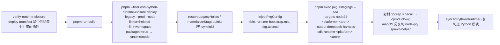

`hatch_build.py` 的 payload 契约：editable 直接返回；sdist 抛 "wheel-only"（**不发布 sdist**）；平台 tag 取 `DSH_RUNTIME_PLATFORM_TAG` 或按 host 推断；要求 payload **恰好**为 `[exe, exe-rg]`（macOS 再加 `-spawn-helper`；Windows 为 `[exe, stem-rg.exe]`）；非 `win_amd64` 检查可执行位；最后设 `pure_python=False`、`infer_tag=False`、`tag=py3-none-<tag>`。

**运行期行为**（`__init__.py`）：

- `resolve_bundled_launch_args` 的优先级：显式 mode → `$DSH_RUNTIME_MODE` → 自动。**自动模式永不选 node carrier**；node 模式形如 `(shutil.which('node'), <runtime>/node/node_modules/@deepseek-ai/dsh/lib/bin.js)`，需要系统 Node ≥ 22.19。
- `main()` **要求显式 `DSH_HOME`**，缺失时打印诊断并 `raise SystemExit(2)`；Windows 用 `subprocess.run` + 返回 code，POSIX 用 `os.execvpe` 直接替换进程。
- 客户端 `HarnessClient._default_launch_args` 返回 `(*base, '--profile', config.profile, *patchArgs)`，默认恰为 **`[<exe>, '--profile', 'sdk']`**；`DSH_HOME` 经子进程 env 传递；`Popen(..., text=True, encoding='utf-8', bufsize=1)`。
- 协议是 **newline-delimited JSON-RPC 2.0**：`initialize` / `session` / `prompt` / `shutdown`；通知含 `session.event` / `status` / `subagent.started` / `subagent.finished`。
- `runtime-bootstrap.mjs`：无 `DSH_SUBPROCESS_RUNNER` 时 `runCli(@deepseek-ai/dsh/lib/bin.js)`；否则先删除该 env 再 `runSelectedSubprocessRunner(selection)`。

**测试**：根 `pytest.ini` 限定 `testpaths = python/sdk/tests`、`norecursedirs = node_modules .git dist-exe`（注释说明递归收集会撞上被忽略的 worktree 或 venv 中的同名模块）。单元测试用假 runtime peer，只有 `test_bundled_runtime.py` 启动真实 carrier 且缺失时 skip。`scripts/smoke-python-runtime.py`（2433 行）是对**已安装 wheel 的黑盒**测试：mock SSE model、13 个 scenario、`assert_installed_wheel_environment` provenance 门禁，golden 在 `scripts/snapshots/python-sdk-single-exe/`。

**约束**：5 平台原生构建、GLIBC ≤ 2.28、macOS 14+、仅 Windows x64、不发布 sdist、wheel < 100MB。

### 2.7 `scripts/` —— 215 项门禁与生成器

分五类：

1. **调度入口**：`run-gates.ts`（1584 行，唯一调度器，17 个 Mode；`Gate` 有 `needs`（硬依赖）与 `after`（只等 settled）；本地类模式并发上限 4；`DSH_GATE_CONCURRENCY` / `DSH_GATE_FAIL_FAST`；`validateGateGraph` 查重、未知依赖与环；`runGate` 收割进程组与后代 PID）、`run-oxlint.ts`、`run-coverage-partitions.ts`、`run-web-snapshots.ts`。
2. **生成器（生成物带 "do not edit by hand" 头，均有 `--check` 配对受 freshness 门禁保护）**：`gen-tsconfig-paths`（生成 `tsconfig.base.json` 中第 255–461 行的逐包别名 region）、`gen-doc-graphs`（→ `capability-seams.md`、`agent-lifecycle.md`、`tool-execution-pipeline.md`、`apps/cli/composition.md`）、`gen-module-graph`、`gen-tool-catalog`、`gen-config-catalog`、`gen-persistence-catalog`、`gen-session-format-catalog`、`gen-cordis-*`、`gen-client-catalog`、`gen-scoped-events`、`gen-third-party-notices`、`gen-translation-brief`。
3. **校验门禁（`verify-*`，按主题分五族）**：
   - 依赖闭包：`verify-runtime-closure`、`verify-application-entrypoints`、`verify-package-dependencies`、`verify-optional-dependency-imports`、`verify-node-next-types`、`verify-package-invariants` / `built-package-invariants`（在 mkdtemp 复制 manifest 声明的 lib 视图，用 plain Node + vendored Loader 经包自引用 import companion）、`verify-npm-install-layout`、`verify-dsh-package-licenses`。
   - 配置与归属：`verify-cordis-config`（只有 entry `config` 与 `disabled` 可插值；裸插件必须在其 resolver manifest 的 `dependencies` 中）、`constraints`（workspace 不变量 + Project Reference 编译器面隔离）、`verify-client-packages`、`verify-client-domain-graph`、`verify-client-ui-i18n`（`MINIMUM_CLIENT_UI_SOURCES=450` 防语料被挖空）、`verify-no-bare-dispatcher`（禁自建 undici agent/fetch dispatcher，含动态 `await import('undici')`）、`verify-skill-invocation-metadata`。
   - 类型与文档：`verify-type-equiv`、`verify-export-jsdoc`、`verify-scoped-events`、`verify-mermaid`、`verify-module-graph`、`verify-subsystem-pages`、`verify-doc-budgets`、`verify-package-readme-model-experience`、`verify-package-readme-limitations`、`doc-typecheck`。
   - Markdown 与双语：`verify-md-wrap`（一段一物理行）、`verify-md-links`（含 `#fragment`）、`verify-doc-refs`、`verify-doc-site-fragments`（JSDOM 检查锚点）、`verify-public-repository-links`、`verify-translation-pairing`。
   - Agent Note 与 vendor：`verify-agent-note-classification` / `-format` / `verify-archived-agent-notes`、`verify-vendored-links`、`rescope-vendor:check`。
4. **交付与发布**：`publint-all.ts`、`publish-npm-baseline`、`publication-payload`、`package-dependency-policy.ts`、`release/*`、`build-python-release.py`、`check-macos-deployment-target.py`。
5. **开发与诊断**：`build.ts`、`clean.ts`、`dev-web.ts`、`change-scope.ts`、`demo-ptc`、`install-lefthook.mjs`、`migrate-packed-session-fixtures.ts`、`attribute-chunk-bytes`、`benchmark-npm-resolution`、`benchmark-next-package-dependency`、`browser-bundled-externals`、`ci-workflow.spec.ts`（1121 行，逐条钉死 workflow 的 runs-on/env/run/needs）、`wine-windows-gates.sh`、`prepare-ci-bubblewrap.sh`。

`scripts/run-gates.ts` 是聚合入口，`package.json` 中的 `check:ci*` / `check:all` / `check:node-compat` 等脚本都是它的具名子集。

### 2.8 `benchmarks/`、`snapshots/`、`website/`

**`benchmarks/`** —— 一目录一条用户路径；Host 侧 `*.bench.ts`、Client 侧 `*.bench.client.ts`；全组只有根一个 `package.json`（`@deepseek-ai/dsh-benchmarks`），tsdown 把 4 个 worker 编到 `.dsh-build/`（`assertBuiltBenchmarkRuntime` 要求路径含 `/benchmarks/.dsh-build/` 且禁 tsx loader）。

| 基准 | 度量主题 |
|---|---|
| `session-open` | 冷开长会话（127,400 事件：首次 open 迁移、reopen、agent-resume、heap） |
| `long-session-browser` | 浏览器端长会话（240 turn：open / page / trajectory，3 个全新 Chromium） |
| `conversation-fold` | Conversation 折叠（200×2000 delta：fold 与 delta scaling） |
| `active-stream-reconnect` | 活跃流重连（100k delta reasoning 前缀） |
| `agent-continuation` | Agent 续跑（request-history / catalog / tool-continuation / profile-continuation） |
| `support/` | 共享负载生成、测量与标定工具 |

**标定规则**（`benchmarks/support/calibration.ts`）：`CI_TIME_SCALE=2`、`PERFORMANCE_BUDGET_HEADROOM=1.25`，故 `ciTimeBudget = ceil(ms × 2 × 1.25)`；**内存与无量纲比值只乘 1.25**（不乘 2）。每个文件都有 recorded-sample control pin 并证明合成回归会被拒绝。

`test:bench` = `build:bench` + `build:web` + `test:bench:built`；CI 的 `node-24-bench`（ubuntu-24.04，15 min）**是 PR 的阻塞判据**，而 master 上没有 perf gate。

**`snapshots/`** —— 只放"JSONL 既作 replay 输入、又作 expected persisted output"的测试；进程必须经 dsh CLI + shipped profile。共 **150 个用例**：

| 目录 | 用例数 | 性质 |
|---|---|---|
| `session/` | 84 | headless，一次性行为 |
| `web/` | 40 | 浏览器 ARIA 证据（adapter 在 `apps/web/tests/`，golden 为 `*.expected.md`） |
| `sdk/` | 18 | 持久 JSON-RPC 控制 + `SDK_ASSERTIONS` |
| `acp/` | 8 | `input.json` 驱动 + `stdout.expected.jsonl` |

用例目录典型内容：`snapshot.yml`（严格 schema：version/scenario/profile/composition/recording/header/replay/platform/permission/environment/workspace/input/session/sessionFormat）、`cordis.yml` 与 `cordis.snapshot.yml`（关 `llm-deepseek`、插 `llm-replay`、compression none）、`session[.vN].jsonl`、`replay.override.json`、`stdout.expected.jsonl`、`workspace.expected/`。

- 文件名规则：`session[.vN].jsonl` / `session.<ordinal>[.vN].jsonl`；v0 省略 `.v0`；最高世代被选中。要保留历史世代必须在 `snapshot.yml` 声明 `sessionFormat.version` 并封闭 coverage。
- committed session 是**归一化不动点**：typed token（`{{session:N}}` 等）、system prompt 用 `{{system}}`、tool schema 用 `{{tools}}`，全文存 sidecar。
- **keyless replay**：真 CLI + `--profile` + patch 列表；`llm-replay` 读 `$DSH_SNAPSHOT_FILE` / `$DSH_SNAPSHOT_OVERRIDE` / `$DSH_SNAPSHOT_CHILD_FILES`，`assertConsumed` 保证 fixture 被耗尽（防止测试悄悄不消费录制数据）。
- `vitest.snapshot.config.ts`：`DSH_SNAPSHOT` 缺省/空/`replay` → replay，另有 `record`、`refresh`，其它值抛错。**只有 `record` 读 `.env`**（需要真 key）。replay 可并行（`maxConcurrency` 默认 `min(5, cpus)`），record/refresh 串行。
- 过滤单个用例：`pnpm run test:snapshot:refresh snapshots/sdk/sdk.snapshot.ts -t text-turn`。

**`website/`** —— 只做 VitePress 配置 + 资产 + 发布清单（唯一手写维护的 md 是 `website/AGENTS.md`；禁止 locale/route/API 的复制树；`project-doc-site.spec.ts` 用 `git ls-files` 断言没有多余 md）。`website/docs.ts` 是发布清单：**188 页**（每 locale 94），区分 `mirroredPages`（两 locale 共用同一英文源）与 `pairedPages`（`docs/foo.md` ↔ `docs/foo.zh.md`）；路由显式重映射（`docs/user/guide/index.md` → `guide/quickstart.md`、`docs/subsystems/*` → `reference/subsystems/*`、`docs/architecture.md` → `reference/index.md`、catalog → `reference/*`、cookbook → `reference/cookbook/*`）。**故意不发布**：`deepseek-llm-api-wire-extensions`、`module-graph`、`event-producer-consumer`、`graph-atlas`。

`scripts/project-doc-site.ts` 按字节偏移改写链接（已发布 → 相对路由；语言切换 → 翻转 locale；图片 → `placeImage`；其余 → GitHub blob/tree 或 raw）、注入 `editSource`/`outline`，并在 `buildEnd` 再 emit 原始 Markdown 页与 `llms.txt`。**死链检查就是 VitePress 缺省行为**（不设 `ignoreDeadLinks`，构建直接抛 `N dead link(s)`）；锚点正确性另由 `verify-doc-site-fragments` 用 JSDOM 检查。

### 2.9 `docs/`、`.agents/`、`.github/` 与双语 i18n 契约

**`docs/`** —— 严格分层的双语文档（`docs/AGENTS.md` 定义标准与字数预算）：

| 目录/文件 | 定位 |
|---|---|
| `architecture.md` | 有序地图：组合、核心包、循环、接缝、扩展点。改 `packages/` 前必读 |
| `subsystems/` | 每个子系统一页参考（类型定义、语义、生成的 Cordis API）。54 个双语对 |
| `cookbook/` | 带编号验证步骤的 how-to（加包 / 加工具 / 加 LLM 适配器 / 加设置卡） |
| `cordis-api/`、`cordis-tutorial/` | Cordis 核心 API 参考与教程 |
| `i18n/` | 双语契约：术语表、配对规则、翻译工作流 |
| `user/` | 面向产品的用户指南（由网站发布） |
| `postmortem/` | 事故复盘（唯一允许"战时叙事"的层级） |
| 生成参考 | `tool-catalog.md`(2269 行) / `config-catalog.md`(3605 行) / `persistence-catalog.md`(1148 行) / `module-graph.md`(1456 行) / `capability-seams.md` / `event-producer-consumer.md` / `agent-lifecycle.md` / `tool-execution-pipeline.md` —— 由源码重新生成并受 freshness 门禁保护，**禁止手改英文源** |

**双语契约**：一对 = 三个文件（`foo.md` / `foo.zh.md` / `foo.i18n.yaml`），两侧**权威相等**，PR 整体合并。`.i18n.yaml` 只有两个键，值是两侧文件字节的 **git blob hash**（`sha1("blob " + len + "\0" + bytes)`），因此"哪一侧被改过"由 Git 对象哈希判定，而非时间戳。全仓 **1437 个 sidecar**，每个恰好两个键。结构签名分五组（headings / code / tables / lists / links）比较，段落边界不参与。合并由 `.gitattributes` 的 `*.i18n.yaml merge=dsh-translation-pairing` + `scripts/merge-translation-pairing-driver.sh` 驱动（探测 tsx，失败退回 `git merge-file` 且仍 `exit 1`）。术语真源是 `docs/i18n/terminology.md`，以 `{{terminology}}` 注入。字数预算在 `scripts/doc-budgets.manifest.json`。

**`.agents/`** —— Agent 工作流基础设施：`notes/{proposed,implemented,rejected,archived}/`（决策记录，`implemented/` 用现在时描述已发布现实，`archived/` 冻结不可改）与 `skills/`（12 个可复用工作流，如 `dsh-code-review`、`dsh-pre-push-checks`、`dsh-doc`、`dsh-prose-standard`、`record-browser-gif`）。

**`.github/`** —— 21 个 workflow + issue 生命周期策略、加权审批、评审归属、PR 模板。

### 2.10 磁盘状态路径

来源：`packages/util/home-paths`、各 provider 的 Config 与 `spec.ts`

`<DSH_HOME>` 解析优先级：显式 `dshHome`/`path` > `$DSH_HOME`（空或全空白视作未设）> `~/.dsh`。目录多为 `0o700`、文件 `0o600`。

| 内容 | 默认/实际路径 |
|---|---|
| Session 持久日志 | `<DSH_HOME>/sessions/--<projectKey>--/<encodeSegment(id)>/session[.vN].jsonl[.zstd]` |
| Session 写租约 | `<session-dir>/session.lock`（POSIX；Windows 用命名内核信号量，无文件） |
| JSON storage root | `<DSH_HOME>/storages` |
| JSON single / per-record unit | `<root>/<unit>.json` / `<root>/<unit>/<table>/<key>.json` + `<root>/<unit>/global.json` |
| workspace 文档（shipped） | `<DSH_HOME>/storages/workspace.json` |
| SQLite storage DB | 配置 `path`（**required，无默认**，可 `:memory:`） |
| 投影 checkpoint | `<storage-json root>/session_projcache/sessions/<sessionId>.json` |
| settings 文档 | `<DSH_HOME>/settings.yaml`（`path` 可覆盖；扩展名决定 YAML/JSON） |
| credentials 文档 | `<DSH_HOME>/.credentials.yaml` |
| 项目 / 用户 `.env` | `<invocation cwd>/.env` / `<DSH_HOME>/.env`（**无向上 walk-up**） |
| 匿名用户 id | `<DSH_HOME>/.anonymous-user-id`（纯 UUID 一行，无版本头） |
| Session 搜索索引 DB | 配置 `path`；shipped web 为 `:memory:` + `openAt: never` |
| 附件图片对象 / 暂存 / 文件对象 / 别名 | `<DSH_HOME>/attachments/v1/{objects,tmp,file-objects,files}/...` |
| 请求图变体缓存 | `<DSH_HOME>/cache/attachments/request-images/<hash[0:2]>/<hash>` |
| spill 文件 | `<root>/session-<sha256(sessionId)[0:12]>/<6 字节随机 hex>-<encodeSegment(name)>`；默认 root = `mkdtempSync(tmpdir()/dsh-spill-)` |

`encodeSegment` 对 `[A-Za-z0-9._-]` 之外的每个 UTF-16 code unit 编成 `~XXXX`（含 `~`），并特判 `.` 与 `..`，因此 `../`、绝对路径、NUL、分隔符无法逃出一个路径段且可逆。

`credentials` 的**查找优先级**（`credentials-local/src/index.ts`）：继承的进程环境（只读，最高，空串视为未设置）> `$DSH_HOME/.credentials.yaml`（provider 管理，可写）> `<invocation cwd>/.env`（只读 fallback）> `$DSH_HOME/.env`（只读 fallback）。设计理由：继承环境是本次运行的显式意图且无法从内部编辑，所以显式地只读而非静默遮蔽写；managed store 高于两个 `.env`，因此 Models 页写入的 key 立即生效。

`settings` 的**优先级只有三层**：schema defaults → composition base（entry config）→ user 文档 section。**不存在 project 层或 env 层**。

---

## 3. 构建、测试与交付流水线

### 3.1 源码平面 vs 产物平面

来源：`docs/development.md#typescript-project-layout`

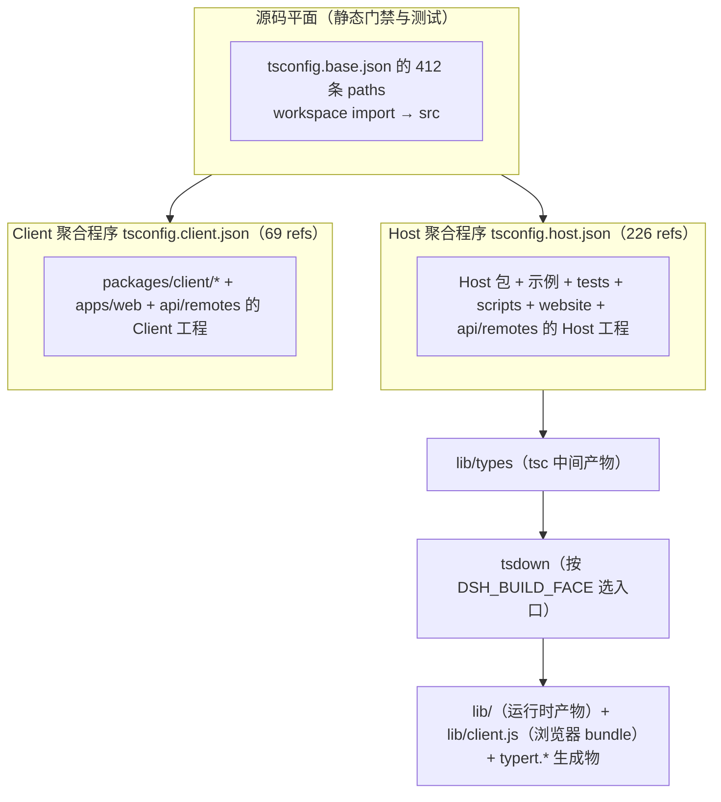

**为什么必须是两个程序**：Host 与 Client 两侧都对 cordis `Context` 接口做 declaration merging，但键对应**不同服务**；同一个 `ts.Program` 看见两处合并会报冲突。该冲突只存在于 `ts.Program` 内（模块解析不会触发），因此方案根可以同时 reference 两个聚合，一个 paths facade 可以横跨两侧。

由此产生三条纪律：`tsconfig.base.json` 永不获得 `include`/`files`；构造全仓 `ts.Program` 的脚本必须显式以 `tsconfig.host.json` 或 `tsconfig.client.json` 播种（**绝不用方案根**）；新包只注册进一个聚合。

`tsconfig.base.json` 的 412 条 `paths` 中，第 255–461 行是 `scripts/gen-tsconfig-paths.ts` **逐包生成**的别名 region —— 用显式别名替代通配符 group 探测，以避免 tsx 的 ESM hook 在某些路径上解析 miss。

**六个双面（split）包**：`api/remotes`、`api/gateway`、`api/session-controller`、`api/workspace-controller`、`client/connection`、`session-query/session-log-export`。它们各有 `tsconfig.host.json` + `tsconfig.client.json` 两个叶子配置，包根 `tsconfig.json` 只是 solution。workspace `constraints` 门禁从"同时存在两个叶子配置"自动发现拆分包，并检查每个引用工程自己的编译面。

三个包（`host/webserver`、`compaction/compaction`、`typert/registry`）被两个聚合共同 reference，作为**共享叶子**，使两侧都对同一份源码做类型检查。

### 3.2 构建顺序

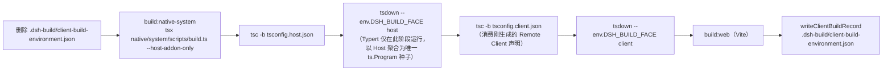

- 两次 tsdown 使用**同一个完整的 workspace 匹配**（`vendor/*`、`packages/*/*`、`apps/cli`，非 client pass 另加 `apps/desktop*`）：既不扫描构建产物来发现 Client 包，也不维护 Host/Client 包过滤清单；包内 `tsdown.config.ts` 通过 `DSH_BUILD_FACE` 选择当前阶段的入口（entry 为 `lib/types/{index,invariant,startup}.js`，format `esm`，platform `node`，target `es2024`，`dts: false`）。普通 Client 插件在 Client 阶段同时产出 Node loader 入口与浏览器 bundle（共享 preset `packages/client/tsdown.client.ts`：closure-factory `window.__ModuleLoader__.load`，lightningcss 内联 CSS）；`api/remotes` 用 `hostPhase: true` 在 Host 阶段先产出 Host 入口。
- tsdown **只消费**前一个 tsc 阶段写入 `lib/types` 的 JavaScript。
- Typert 只在 Host tsdown 运行，同时生成 Host 反射产物与 Host-for-Client 的 Remote 投影；Client tsdown 不启动 Typert。
- `pnpm run typecheck` 与 `pnpm run lint` 都先跑 `build:lib:host`（含生成的 Typert 契约）再跑 Client tsc / oxlint；`*:contracts-ready` 变体假定契约已生成 —— 这是 source/artifact 纪律的**唯一明示例外**。
- 构建会嵌入根包版本、7 位源码 commit、以及本地脏标记；`build:official` 是 CI/发布产物的跨平台等价物且省略脏标记。`scripts/client-build-environment.ts` 采集 `DSH_CLIENT_*` 前缀的公共值 + `DSH_BUILD_CLIENT_PROFILE` 选择器，写入 gitignored 的 record，并登记 artifact patterns（`apps/web/dist/**/*` 与 `packages/*/*/lib/client.js(.map)`）；发布打包与 built Web 测试会拒绝缺失的 record 或被后续部分构建改动的产物。

### 3.3 测试分类

| 命令 | 配置 | 内容 |
|---|---|---|
| `pnpm run test` | `vitest.config.ts` | 单元测试；分 thread-safe 与 process-bound 两个 project |
| `pnpm run test:coverage` | 同上 + `--coverage` | **CI 覆盖率门禁**：`packages/*/*/src` 每文件 statements/branches/functions/lines **全 100%** |
| `pnpm run test:e2e` | `vitest.e2e.config.ts` | 真实 API（`packages/*/*/tests/**/*.e2e.ts` + `apps/cli/tests`）；retry 2；workers = `DSH_E2E_MAX_WORKERS`（默认 4）；无 key 自动跳过 |
| `pnpm run test:snapshot` | `vitest.snapshot.config.ts` | keyless 录制会话经 shipped profile 重放 |
| `pnpm run test:expected` | `vitest.expected.config.ts` | `apps/cli/tests/**/*.expected.e2e.ts` |
| `pnpm run test:web` / `:built` / `:ci` | `vitest.web.config.ts` | `apps/web/tests` + inspector 浏览器 e2e；`fileParallelism: false` |
| `pnpm run test:web:perf` | `vitest.web.perf.config.ts` | `*.perf.ts`，`--expose-gc`；**不进 CI** |
| `pnpm run test:web:stress` | `vitest.web-stress.config.ts` | `*.stress.ts`，opt-in |
| `pnpm run test:bench` | `vitest.bench.config.ts` | `fileParallelism: false`、`maxWorkers: 1`、600s |
| `pnpm run test:gui` | — | 直接跑 `packages/client` + `packages/host` |

`vitest.shared.ts` 提供 `vitestExecArgv`（`--no-webstorage`）与 `standardDecoratorPlugin()`（用 `ts.transpileModule` 处理标准 decorator，合成的 `__esDecorate` 标记为 v8 ignore）。

覆盖率按 `DSH_COVERAGE_PARTITIONS`（CI = 4）分区，经 `scripts/run-coverage-partitions.ts` 合并 blob。重型套件豁免在 `scripts/coverage-exempt.ts`，以 `DSH_COVERAGE_EXEMPT_HEAVY=1` 从未插桩 lane 排除、由 `coverage-exempt-heavy` 并行跑。

> 注意：`test` 与 `test:coverage` 覆盖不了两个 SDK —— **TypeScript 与 Python SDK 的期望输出必须在同一个 PR 内更新**（agent-loop / session-lifecycle / `SessionEventMap` 变更时）。

### 3.4 本地 Git hooks（lefthook）

`lefthook.yml` 是**快速本地检查点**，故意不跑测试、快照、文档检查、构建或 hygiene：

- `pre-commit`：校验暂存的 i18n 配对记录与 archived notes、用 `.oxlintrc.staged.json` 快速档 lint 并带一次有界重试自动修复、在输入变化时重新生成 `THIRD_PARTY_NOTICES.md`、`git diff --cached --check` 检查空白错误、跑 `check-vendor-manifest.sh`。
- `pre-merge-commit`：同样的配对检查。
- `pre-push`：`pnpm run typecheck`（会先完成 Host lib 阶段，含 Typert 契约生成）。

贡献者可显式开启完整本地门禁集：`pnpm run check:all`（独立于 Git hooks，且**不是** agent 指令）。

其他静态工具：oxlint（`typeAware: true`、`categories.correctness` 关闭、显式 `typescript/*` + `sonarjs/*` 规则、忽略 vendor/native/lib/js/config.ts）、jscpd（`minTokens 60`、`minLines 6`、`mild`、忽略 tests、`exitCode 1`）。

### 3.5 CI 与发布

**`ci.yml`（PR only）的 job 与阻塞关系**：

| Job | 内容 |
|---|---|
| `node-24` | `check:ci:static`，`DSH_GATE_CONCURRENCY=8` |
| `node-24-coverage` | `check:ci:coverage`，`DSH_COVERAGE_MAX_WORKERS=6`、partitions 4、timeout 90000 |
| `node-24-bench` | `check:ci:bench`，ubuntu-24.04，**PR 阻塞判据**，无 runner failover |
| `node-24-consumers` | `check:ci:consumers`（snapshots + artifacts），`DSH_GATE_CONCURRENCY=10`、`DSH_WEB_SNAPSHOT_WORKERS=6`、`DSH_OXLINT_THREADS=8` |
| `node-compat` | Node 22.19 / 24.9 / 26 矩阵 |
| `python-sdk` / `python-runtime` | `uv run pytest` / 可复用的 linux-x64 + win-x64 单 exe 构建 |
| `windows-*` | build / coverage / native-tests / observational |
| `all-checks-passed` | 汇总门禁（`needs` **不含** windows coverage 与 observational） |

- Runner failover 由 `vars.DSH_CI_FAILOVER_LINUX` / `_WINDOWS` 三元表达式选择（blacksmith / selfhosted / hosted；**Dependabot 强制 hosted**）；`ci-workflow.spec.ts` 用 `runInNewContext` 逐一证明三条分支。
- 真实 API 工作流（`e2e.yml`）单独运行 `pnpm run test:e2e`。
- 快照与 expected-output **没有**独立的 workflow 直接调用（`check:ci:snapshot` / `check:ci:artifacts` 仅作为子集存在），实际经 `node-24-consumers` 的 `check:ci:consumers` 进入。
- `ci-master.yml` 在 push master 与手动派发时运行；**master 上没有 perf gate**。
- Windows 信号由 CI 拥有；`pnpm run check:windows-wine` **只在诊断已知 Windows 失败时**本地使用。

**发布**：两个 npm family —— `DshFamily`（一个共享版本，tag `dsh-v*`，dist-tag alpha/canary/next/latest）与 `VendorFamily`（各自独立版本，tag `vendor-<name>-v*`）。脚本链：`bump` → `pack`（按拓扑发布序 `pnpm pack` + payload 校验 + `publish-order.txt`）→ `verify` → `verify-packed-install`（`file:` consumer + `npm install --omit=optional` + 实跑 `dsh --version`）→ `publish`（`npm view dist.integrity` 比较：404 发布 / 相同跳过 / 不同失败；4 次重试、2000 ms 间隔）。**没有 npm provenance / sigstore**；native 发布支持 OIDC trusted publishing（`NPM_TOKEN` 作为 fallback）。

**PyPI**：`build-exe-for-python-sdk.yml`（可复用：plan → sdk-wheel → 5 个 target build，含 manylinux 上重建 node-pty、GLIBC ≤ 2.28、clean-venv 黑盒、可选 sdk-live、lipo/deployment-target）→ `python-release.yml`（build → python-compat 3.10/3.14 → validate：仓库白名单 + 发布开关 + `python-v<version>` tag + **恰好 6 个 wheel** diff + 每个 < 100MB + `twine check` + `SHA256SUMS`）→ `publish-runtime`（`pypi-runtime`）→ `publish-sdk`（`pypi`）。另有 `.gitlab-ci.yml` 以同一 tag 向 GitLab registry 发布同样 6 个 wheel。

---

## 4. 扩展点速查表

来源：`docs/architecture.md#where-new-behavior-goes`

| 想做的事 | 机制 |
|---|---|
| 加模型 provider | 在 `ctx.llm` 上注册适配器 |
| 加模型可见能力 | 在 `ctx.tools` 上注册；其 schema 自动进入 prompt 装配 |
| 给单个 session 不同的能力集 | 组合 agent preset；其中的 service 行需要 `isolate` realm |
| 加 shell 执行 | 注册 `ctx.shell` 后端；local 后端经 `ctx.subprocess` spawn |
| 加持久终端执行 | 注册 `ctx.terminals` 后端 + `dsh-tool-terminal` |
| 加人类命令 | 在 `ctx.commands` 上注册；**不消耗模型 turn** |
| 加后台工作 | 在 `ctx.jobs` 上注册；`job_*` 工具收集或停止它 |
| 从外部 webhook 启动 Session | 在 `ctx.webhookRuntime` 上注册可信规则并挂 provider 适配器 |
| 加文件系统访问或策略 | 注册 `ctx.fs` provider 或监听 `fs/*` 事件 |
| 限制 spawn 的进程 | 用 `ctx.sandbox` 后端；消费方在 spawn 前包裹 argv |
| 拦截请求 / 工具 / turn | 用对应的 `agent/*` 或 `tools/*` 事件；`agent/turn-stopping` 可停止 turn |
| 加模型可见上下文 | 调 `agent.inject()`；它落在下一次被接纳的请求里 |
| 加 UI 或编辑器集成 | 驱动 `ctx.agents`，从 `session/event` 渲染 |
| 加 Web Client Chat 节点 | 注册 `ConversationNodeDefinition` + keyed renderer |
| 加持久 session 状态 | 扩展 `SessionEventMap`；从日志渲染与重放 |
| 生成会话标题 | 注册唯一的 `ctx.sessionTitle` provider（**单槽**，第二次注册抛错） |
| 管理同会话目标 | 用 `ctx.goals`；经 `agent/*` 续跑 |
| 在 turn 边界 fork session | `ctx.agents.create({ sessionId, seed, meta: { parentSession, seedLength } })` |
| 把 session 存到新后端 | 在共享 handle 脚手架之上实现 `SessionPersistence`（`create`/`open`/`flush`/`stat`/`list`） |
| 加会话日志导出 | 用 `session-log-export`（Host `/export` 命令 + `/api/session.export`），**不是** persistence 的方法 |
| 把注册限定到单个 agent | 用那个 agent 的 `agent.ctx` |

---

## 5. 关键设计约束（改代码前必读）

摘自根 `AGENTS.md` 与 `packages/AGENTS.md`：

1. **注册即 Effect**：每个贡献都经 `ctx.effect()` / `ctx.on()`；registry 的 `register()` 返回 disposer。
2. **模型可见 ⟺ 已记录**：新的模型可见输入必须新增 session event。
3. **插件优先，而非改主循环**：新行为挂在文档化扩展点上；改 `agent-loop` 必须同步更新 `docs/architecture.md`。
4. **能力接缝三角齐全**：Service Definition / Provider / Consumer 三者完备，只在角色独立演化时才分包。
5. **显式优于隐式（包边界）**：默认值是 owner 实现里显式的 `resolve(request): Spec` 步骤，**绝不是 `run()` 里隐藏的 `?? default`**（模板是 dsh-shell 的 request/spec 拆分）。
6. **插件里禁止硬编码可调参数**：随部署变化的选项必须是可校验、可从 `cordis.yml` 修改的 `Config` 字段；`DEFAULT_*` 常量或测试钩子**不算**可配置性。协议常量、外部规范、安全不变量保持固定。
7. **配置错误要响亮失败**：自包含的在 load 时失败，否则在最早可解析点失败；**绝不静默跳过缺失的引用对象**。
8. **跨边界的不透明 id 必须 branded**（`Branded<B>` from `dsh-brand`），绝不用裸 `string`。
9. **信任类型化同进程边界**：不要为静态接口已经要求的取值加运行时校验；只在 parser/config、队列、模型/工具 JSON、持久/文件、worker、进程、线缆边界校验。
10. **判别标签上必须 switch**：封闭联合以 `assertNever` 结尾；可合并扩展的联合走文档化的 default 分支。
11. **Waterfall 监听者必须调用 `next()`** 才算委派。
12. **源码平面与产物平面绝不混用**：静态门禁与测试经 tsconfig `paths` 解析到 `src` 并在干净树上通过；消费 `lib/` 的门禁要显式声明该依赖。
13. **客户端 UI 文案归 locale 所有**：产品文案必须走类型化字典与 `t` 或本地化 primitive props；`verify-client-ui-i18n` 拒绝硬编码文案。
14. **非平凡改动必须在同一个 PR 内附带 Agent Note**；只有机械/局部编辑豁免。
15. **文档与代码同行**：受影响的 README 与 JSDoc 契约要一起更新；一段一物理行；一个事实只有一个归属。
16. `FIXME` / `TODO` / `XXX` 按紧迫度使用；文件以恰好一个尾随换行结束。

---

## 6. 一句话总结

DeepSeek Harness 是**把"agent 运行时"本身做成可组合插件树**的工程：Cordis 提供 Service + Typed Event + 可逆 Effect 的装配语义，`packages/bundle` 用有序 patch 层把 268 个包装配成 5 个可运行 profile，`core` 的六个包构成不可绕过的脊柱（会话日志是唯一真相），所有外围能力（模型、shell、文件、沙箱、Web、子代理、工作流、持久化）都是**三角齐全的能力接缝**——换 Provider 就换产品行为，改行为挂扩展点而不改主循环。

---

## 附录 A：本次审计发现的事实性不一致

以下 8 条均在本次审计中于本 checkout 逐条复核确认。它们**不影响本文档的架构结论**，但属于值得上游修复的问题；其中第 7、8 条是**仓库自身文档与源码矛盾**。

| # | 位置 | 现象 | 影响 |
|---|---|---|---|
| 1 | `package.json` 的 legacy `workspaces` 字段 | 只列 `vendor/*`、`packages/*/*`、`native/system`、`native/system/packages/*`、`apps/*`、`website`；**缺 `benchmarks` 与 `python/sdk-runtime`**（`pnpm-workspace.yaml` 两个都列了） | pnpm 实际以 `pnpm-workspace.yaml` 为准，当前无功能影响；但读取 legacy 字段的工具会得到不完整的 workspace 视图 |
| 2 | `docs/AGENTS.md` 字数预算段 | 正文写 `testing.md 1,300`，而 `scripts/doc-budgets.manifest.json` 为 `docs/testing.md: 1350`；正文还提到 `examples/AGENTS.md 310`，但仓库**没有 `examples/` 目录** | 门禁以 manifest 为准，故正文数字是错的 |
| 3 | `python/sdk-runtime/src/deepseek_harness_runtime/deepseek-harness-runtime.json` | `"version": "0.0.0-dev"`，而发行版本是 `0.0.0.dev0`；`build-python-release.py` 不校验该文件 | 拼写不一致（`-` vs `.`）；当前无消费者依赖它，属潜在隐患 |
| 4 | runtime payload 命名规则 | `hatch_build.py` 与 `build-python-release.py` **各实现一份** | 规则漂移风险；应提取为单一真源 |
| 5 | `.github/workflows/` | **没有** workflow 直接调用 `check:ci:snapshot` 或 `check:ci:artifacts`（两者经 `ci.yml` 的 `node-24-consumers` → `check:ci:consumers` 进入） | 单独触发这两个入口只能手动 dispatch，易被误认为"CI 未覆盖快照" |
| 6 | `native/system/**/package.json` | `repository.url` 指向 `github.com/deepseek-harness/deepseek-harness`，而仓库其余部分指向 `github.com/deepseek-ai/deepseek-harness` | 来源归属不一致 |
| 7 | `docs/architecture.md:157` | 写 "implement `SessionPersistence` (`create`/`open`/`stat`/`list`/`export`)"，但 `packages/session/session-persistence/src/index.ts:135-198` 只声明 **5 个** abstract 方法：`create`/`open`/`flush`/`stat`/`list`，**没有 `export`** | 架构文档误导实现者；session 导出是另一个包 `session-log-export` 的职责 |
| 8 | `packages/host/webserver/README.md:12` | 写 "Electron loads dist over `file://` and carries fetch over an IPC bridge"，但 `apps/desktop/src/main.ts:26,45,283` 实际注册并处理 **`dsh-app://` 自定义特权协议** | README 描述不准确；`file://` 无 `supportFetchAPI`/`codeCache` 特权，无法承载该页面 |

> 计数口径说明：本仓库实际有 **21** 个 workflow 文件（`ls .github/workflows/*.yml`），子审计曾报 20。

---

*本文档生成日期：2026-09-12*
*源码版本：`deepseek-ai/deepseek-harness` `0.1.5-rc.2` @ `c291e79`*
